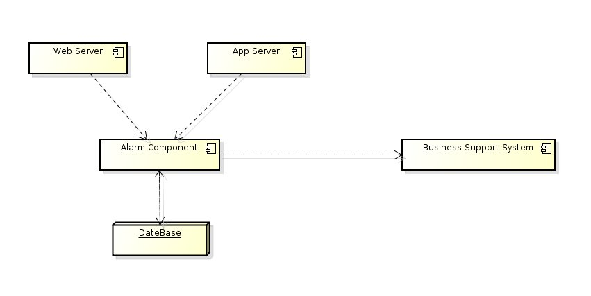
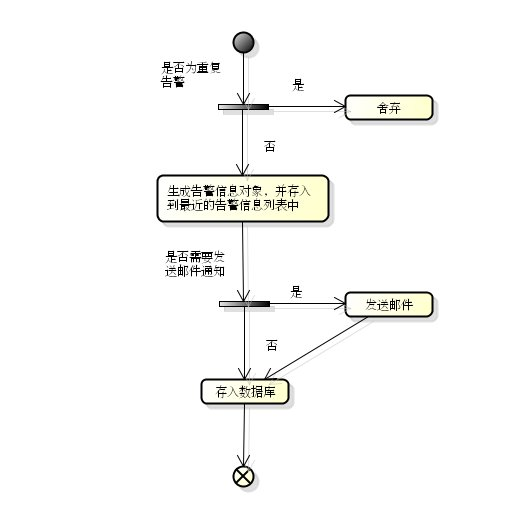
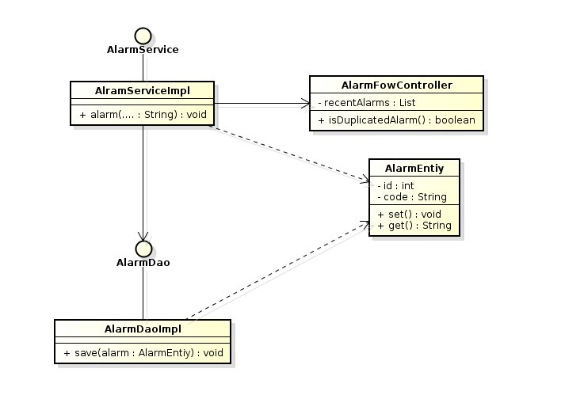

============================================
Monitoring System
============================================
为了支撑庞大的系统，我们需要完备的监控系统。
我们的监控对象包括系统（CPU，disk，memory），软件（DataBase，WebContainer，Server）等等。

System Monitoring
============================================
利用开源的Zabbix或者Nagios可以实现对系统集群，负载，消息队列，数据库，Apache等的监控。

Business Monitoring
============================================
设计一个小的，内嵌的业务告警系统，我将给出：愿景，系统部署图，详细设计（接口定义，时序图）等。

愿景
--------------------------------------------
完成一个小型的内嵌业务告警组件，当我们的业务系统发生故障时，能通过此组建的调用，第一时间通知运营支撑人员，并将告警持久化。

1. 对于严重告警，能及时通知业务支撑人员；
2. 流控，屏蔽相似告警，防止数据库出问题；
3. 对内调用接口，通用，包含以下信息：level, subsystem, context, code；
4. 对外接口，通用，包含以下信息：level, subsystem, code, solution；

系统部署图
--------------------------------------------



详细设计
--------------------------------------------

数据库设计
````````````````````````````````````````````
告警表设计如下：

+------------+-----------+------------+----------+----------+----------+----------+
| 列名       | 类型      | 含义       | 是否主键 | 是否非空 | 是否索引 | 备注     |
+============+===========+============+==========+==========+==========+==========+
| id         | int       | 自增主键   | 是       | 是       | 是       |          |
+------------+-----------+------------+----------+----------+----------+----------+
| level      | String    | 告警级别   | 否       | 是       | 是       |          |
+------------+-----------+------------+----------+----------+----------+----------+
| code       | String    | 告警代码   | 否       | 是       | 否       |          |
+------------+-----------+------------+----------+----------+----------+----------+
| subsystem  | String    | 子系统名称 | 否       | 是       | 是       |          |
+------------+-----------+------------+----------+----------+----------+----------+
| context    | String    | 上下文     | 否       | 是       | 否       | Json格式 |
+------------+-----------+------------+----------+----------+----------+----------+
| message    | String    | 告警信息   | 否       | 是       | 否       |          |
+------------+-----------+------------+----------+----------+----------+----------+
| solved     | boolean   | 是否解决   | 否       | 是       | 是       |          |
+------------+-----------+------------+----------+----------+----------+----------+
| createTime | timestamp | 创建时间   | 否       | 是       | 是       |          |
+------------+-----------+------------+----------+----------+----------+----------+
| solvedTime | timestamp | 解决时间   | 否       | 是       | 是       |          |
+------------+-----------+------------+----------+----------+----------+----------+

活动图
````````````````````````````````````````````
这里通过在内存中维护一个带有时间的告警对象列表，用来判断新进的告警是否为重复告警，对于超时的告警对象，将从这个列表中被移除。



类图
````````````````````````````````````````````


接口定义
````````````````````````````````````````````
public static void alarm(AlarmLevel.warn, String message, String subsystem, String contextInJson, String code);

public static List<Alarm> listAlarms();

public static List<Alarm> listAlarms(Date date);

public static Page<Alarm> listAlarms(Page page);

public static Alarm getAlarm(String id);

public static void ignoreAlarm(String id);

public static void solveAlarm(String id);

