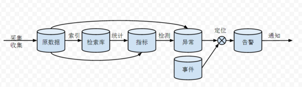

============================================
Monitoring System
============================================
为了支撑庞大的系统，我们需要完备的监控系统。
我们的监控对象包括系统（CPU，disk，memory），软件（DataBase，WebContainer，Server）等等。

System Monitoring
============================================
利用开源的Zabbix或者Nagios可以实现对系统集群，负载，消息队列，数据库，Apache等的监控。
主流的开源监控遵循以下模式：



* 采集/收集：数据可能来自于业务的db，可能来自于日志文件，可能是由业务程序内置上报的。通过各种手段采集收集到“原数据库”里。什么是“原数据库”？比如kafka队列。比如logstash上报前把数据汇总到的redis数据库。“原数据库”的存在是为了把分散的数据汇总到一处，方便后续的处理；
* 索引：索引主要是为了日志存在的。为了让日志可以检索，需要把日志数据进行切分，提取出字段和关键字录入到“检索库”里。这就是著名的ELK最擅长的事情。Logstash负责索引操作，Elasticsearch充当检索库的角色；
* 统计：指标库最常见的就是给每个ip存放一份cpu使用率的时间序列。对于这种情况，原数据采集了之后直接录入指标库就行了。另外一种比如是nginx的access log，采集到之后需要经过统计才能得出某某url在5分钟内被访问了xx次的数据。统计最简单的形式比如statsd，复杂的可以用storm写自定义的流式计算任务，更复杂的甚至涉及机器学习，比如summo logic。指标库一般使用的是opentsdb等时间序列数据库，但是我强烈推荐Elasticsearch：http://taowen.gitbooks.io/tsdb/content/；
* 异常检测：传统的告警就是比对一个静态的阈值。对于错误率，访问延迟等指标用静态阈值确实是没有问题的。但是对于5分钟内的收入，访问人数等综合的业务指标很难用静态阈值去做检测异常。复杂的异常检测会利用曲线的时间周期性，和相关曲线之间的相关性去定义动态的阈值。etsy的skyline是开源组件里比较著名的一个；
* 告警：告警和异常检测是两个过程。不是每个异常都值得通知运维跟进处理（起码可以做一个频率收敛），也不是把原始异常以xx小于xx这样的形式告诉给运维就可以了（可以把告警相关的故障一起通知了）。这里个从异常到告警的过程需要做到确认这个异常是一个值得通知的告警，并且能够做一个初步的故障定位。最简单的定位的手段是就把其他部门的告警（比如网络部门的网络质量告警，安全部门的DDoS告警），以及流程单据（发布单）做为事件纳入事件库。通过查询事件库定位原因。

很多零散的工作做如下整合：

1. 拨测：定时curl一下某个url，有问题就告警，走原数据=>直接录入为异常=>告警；
2. 日志集中检索：ELK的经典用法，走原数据=>检索库；
3. 日志告警：5分钟Error大于xxx次告警，走原数据=>实时统计出指标=>检测异常=>告警；
4. 指标告警：cpu使用率大于xxx告警，走原数据=>录入到指标库=>检测异常=>告警。

Business Monitoring
============================================
设计一个小的，内嵌的业务告警系统，我将给出：愿景，系统部署图，详细设计（接口定义，时序图）等。

愿景
--------------------------------------------
完成一个小型的内嵌业务告警组件，当我们的业务系统发生故障时，能通过此组建的调用，第一时间通知运营支撑人员，并将告警持久化。

1. 受众是运营运维人员，按照告警级别对告警进行处理，通知相关人员；
2. 流控，屏蔽相似告警，通过在内存中维护一个近期告警来进行屏蔽；
3. 告警调用接口，通用，包含以下信息：level, code, subsystem, message；
4. 展示调用接口，通用，包含以下信息：level, code, subsystem, solution(saved), createTime, fixedTime(saved)；

系统部署图
--------------------------------------------

.. image:: images/business_monitor_component.jpg 

详细设计
--------------------------------------------

数据库设计
````````````````````````````````````````````
告警表设计如下：

+------------+-----------+------------+----------+----------+----------+----------+
| 列名       | 类型      | 含义       | 是否主键 | 是否非空 | 是否索引 | 备注     |
+============+===========+============+==========+==========+==========+==========+
| id         | int       | 自增主键   | 是       | 是       | 是       |          |
+------------+-----------+------------+----------+----------+----------+----------+
| level      | String    | 告警级别   | 否       | 是       | 是       |          |
+------------+-----------+------------+----------+----------+----------+----------+
| code       | String    | 告警代码   | 否       | 是       | 否       |          |
+------------+-----------+------------+----------+----------+----------+----------+
| subsystem  | String    | 子系统名称 | 否       | 是       | 是       |          |
+------------+-----------+------------+----------+----------+----------+----------+
| context    | String    | 上下文     | 否       | 是       | 否       | Json格式 |
+------------+-----------+------------+----------+----------+----------+----------+
| message    | String    | 告警信息   | 否       | 是       | 否       |          |
+------------+-----------+------------+----------+----------+----------+----------+
| solved     | boolean   | 是否解决   | 否       | 是       | 是       | 暂时保留 |
+------------+-----------+------------+----------+----------+----------+----------+
| createTime | timestamp | 创建时间   | 否       | 是       | 是       |          |
+------------+-----------+------------+----------+----------+----------+----------+
| fixedTime  | timestamp | 解决时间   | 否       | 是       | 是       | 暂时保留 |
+------------+-----------+------------+----------+----------+----------+----------+

活动图
````````````````````````````````````````````
这里通过在内存中维护一个带有时间的告警对象列表，用来判断新进的告警是否为重复告警，对于超时的告警对象，将从这个列表中被移除。

.. image:: images/business_monitor_activity.jpg

类图
````````````````````````````````````````````
.. image:: images/business_monitor_class.jpg

接口定义
````````````````````````````````````````````
public void alarm(AlarmLevel level, String code, String subsystem, String message);

public List<Alarm> listAlarms(Date date, Sort sort);

public Alarm getAlarm(String id);

public void ignoreAlarm(String id);

public void solveAlarm(String id);

