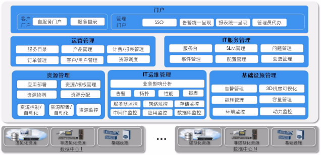
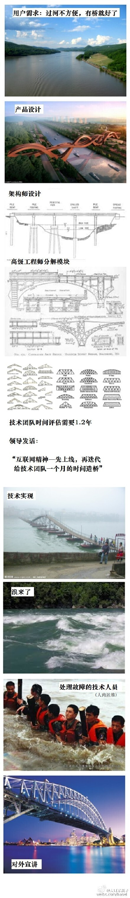

=======================================
Cloud OS 总结
=======================================
商用云平台的架构和设计

基本概念
=======================================
IaaS: Infrastructure as a Service
PaaS: Plantform as a Service
SaaS: Software as a Service
VPNaaS: Virtual Private Network as a Serivce
LBaaS: Load Balance as a Service
SDNaaS: Software Define Network as a Service
编排：根据业务需求自动产生相应配置的虚拟机

华为平台
----------------------------------------
华为依靠Xen虚拟化技术，在开源的SLES11SP1的基础之上对操作系统进行修改，加入自己的agent进行监控管理，节点的镜像都是自己修改过的，具有很高的可靠性和稳定性，适用于小型的数据中心。
之所以这样说，是因为华为的云平台在网络部署上只支持vlan的模式，这就限制了子网的个数，不能超过4096。

华为的ManageOne解决方案包括如下几个组建：
FC, FusionCompute负责管理底层虚拟化资源，包括主机、存储、网络的虚拟化管理，可以直接操作底层硬件与虚拟化资源池
FM, FusionManager负责资源的进一步抽象，加入租户的概念，南向与FC对接，直接控制FC，北向与CSB进行对接，属于中间层
CSB, 运营平台（因为华为的人也不知道怎么翻译）
IT服务管理平台
用户门户
整个架构还是很值得学习的。

东信Aclome
---------------------------------------
Aclome平台是由CloudStack+XenServer搭建的一套虚拟化平台，东信主要是修改前台并加入了动环的监控，并能与施耐德的设备进行集成（意味着动环管理不能集成其他厂商），具有良好的界面及动环监控能力。
但东信本身的实质还是简单的开源产品，并没有经过仔细的改造和测试，类似这样的东西是不能进行商用的。并且重启后很多服务要手动重新调试，增加了部署和调试的难度。

总结
=======================================
经过几轮的测试和学习，总结下云平台的几个要素：

1. 资源的监控能力
#. 虚拟机的管理能力
#. 弹性扩展和收缩能力（autoscaling）
#. 网络的管理能力（SDN）
#. 租户的管理与隔离（VPC业务）
#. 块的动态挂载和扩展
#. 镜像的管理能力
#. 网络安全与虚拟机安全防护能力
#. 负载均衡能力
#. 对象存储（云盘业务）
#. 强大的API机制及相应的SDK

软件开发模式
=======================================
这里因为第一篇文章，也是我第一个接触到的成品软件，我这里发个小漫画，惊醒我们这个行业的世人，莫学错了路。

