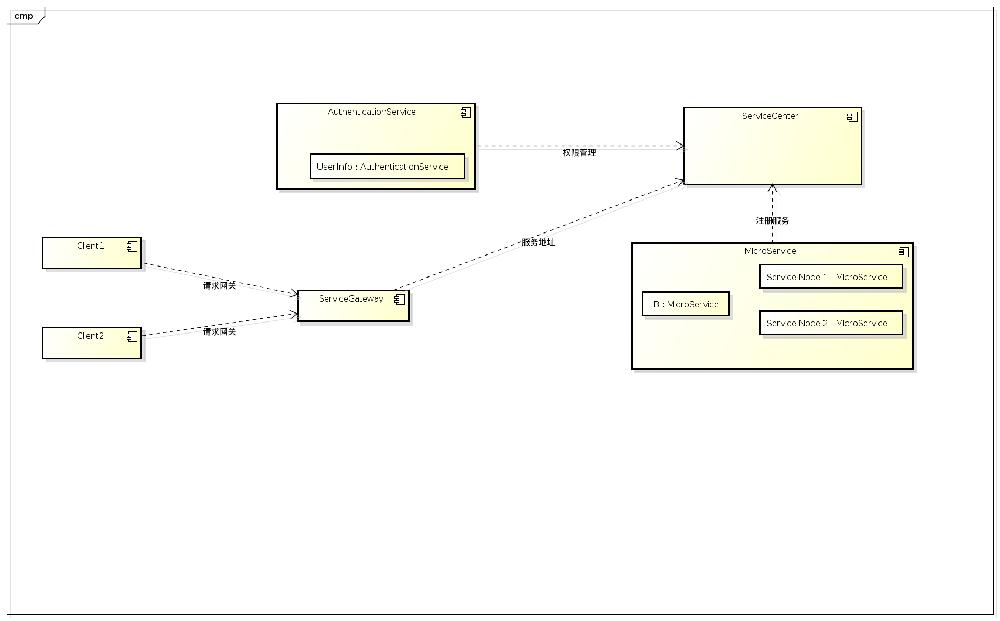

=======================================
微服务
=======================================

微服务介绍
=======================================
微服务是一种架构风格，一个大型复杂软件应用由一个或多个微服务组成，系统中的各个微服务可被独立部署，各个微服务之间是松耦合的。

概念
---------------------------------------
微服务是人们提出新的思路，将原来组件化的代码模块进行服务化，将原来基于接口的编程

1. 通过服务实现应用的组件化，微服务架构中将组件定义为可被独立替换和升级的软件单元，在应用架构设计中通过将整体应用切分成可独立部署及升级的微服务方式进行组件化设计；
2. 围绕业务能力组织服务，微服务架构采取以业务能力为出发点组织服务的策略，因此微服务团队的组织结构必须是跨功能的（如：既管应用，也管数据库）、强搭配的DevOps开发运维一体化团队；
3. 团队负责整个微服务的生命周期，包括开发、部署、运营、运维；
4. 通讯机制或组件应该尽量简单及松耦合，RESTful HTTP协议和仅提供消息路由功能的轻量级异步机制是微服务架构中最常用的通讯机制；
5. 每个微服务考虑各自最适合的平台和工具、环境及数据库等；
6. 微服务架构所带来的一个后果是必须考虑每个服务的失败容错机制。因此，微服务非常重视建立架构及业务相关指标的实时监控和日志机制；

微服务的优缺点
---------------------------------------
优点：

1. 微服务可以为开发者提供独立开发和部署的便利；
#. 通过分解巨大单体式应用为多个服务方法解决了复杂性问题；
#. 这种架构使得每个服务都可以有专门开发团队来开发；
#. 微服务架构模式是每个微服务独立的部署；
#. 微服务架构模式使得每个服务独立扩展；
   

缺点：

1. 由于是分布式部署，测试变得繁重而复杂；
#. 分布式的部署带来的固有复杂性，包括环境、消息传递等；
#. 运维、测试成本的突增；

微服务的应用场景
---------------------------------------
1. 大型系统的应用搭建；
2. 明确未来发展的复杂架构方向；

避免使用微服务的场景：
---------------------------------------
1. 小型系统，业务内聚程度高；
2. 开发团队能力有限，部署、异步消息等过度依赖运维团队；

麟龙微服务的设计
=======================================

微服务中的角色
---------------------------------------
1. 服务中心Service Center：负责服务的注册、发现、监控、卸载；
2. 服务网关Service Gateway：负责统一的服务接口；
3. 认证授权中心Authentication&Authorization Center：负责管理用户信息和权限；
4. 客户端程序Consumer/Client：客户端组件，调用服务网关的接口；
5. 微服务组件Micro Service：以轻量级的协议提供服务的单元；

各个组件之间的依赖关系：

服务注册时序图：

.. image:: images/sequence0.png
   :width: 1000 px

服务请求时序图：

最佳实践
=======================================
使用Netflix相关组件可以构建完整的微服务框架，同时Java开发者可以使用Spring Cloud来实现微服务是当前比较流行的趋势。

* Eureka:　服务注册发现框架
* Zuul:　服务网关
* Karyon:　服务端框架
* Ribbon:　客户端框架
* Hystrix: 服务容错组件
* Archaius: 服务配置组件
* Servo: Metrics组件
* Blitz4j: 日志组件
