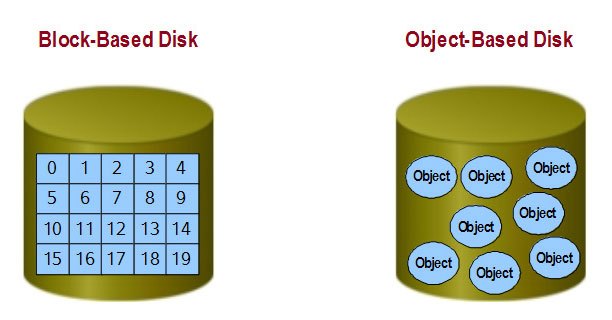
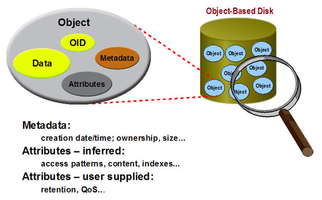
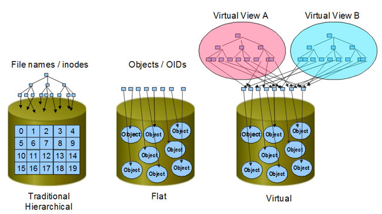

==========================================
Storage
==========================================

Concept
------------------------------------------
存储在云计算中扮演了重要的位置，大数据时代的即将来临，推动了存储的不断发展，就我个人见过的集中式存储就给我留下很深的印象。
（又大又沉，我们几个人搬差点把腰闪了，NetApp的大存储，得有4百斤以上）

Block storage: 块存储，典型的是SAN，提供空的块，由用户自己进行做文件系统。

File system storage: 文件存储，典型的是NAS，提供文件系统。

Object-based storage: 对象存储，核心是将数据通路和控制通路（元数据）分离，并且基于对象存储设备构建存储系统。

ObjectStorage
------------------------------------------
对象存储是当前大力推崇的存储方案，上面每个OSD能智能的管理上面的数据。它综合了块存储的高效访问速度和共享文件系统的优点。
传统的文件服务器既负责管理VFS，又负责管理inode；而对象存储将inode的管理分布在OSD节点中。
对象存储可以同时读取多个OSD中的数据，实现并行的高吞吐量。


*传统的存储与对象存储的对比：*




*对象存储的数据组成：*



*传统的访问层次和虚拟数据访问模型：*



Metadata Server(MDS, 元数据服务)
``````````````````````````````````````````
MDS control the interaction between client and OSD object. It supplies the metadata, including logical view, OSD.

MDS提供了client直接访问对象的能力，OSD收到请求时先验证该能力，才可以访问数据；

文件和目录的访问管理；

Client Cache的一致性，MDS支持基于Client的Cache，当Cache文件发生改变时，将通知Client刷新Cache。

Object Storage Client
``````````````````````````````````````````
计算节点上实现对象存储的Client，对象存储给用户的接口也是标准的POSIX文件访问接口。

1) 客户端应用发出请求；
2) 文件系统向元数据服务器发送请求，获取数据所在的OSD；
3) 直接想所在OSD发送请求；
4) OSD得到请求后，判断要读取的OSD，并根据其认证方式要求客户端认证，授权后将数据发送给客户端；
5) 文件系统收到OSD返回的数据后，读取结束。
