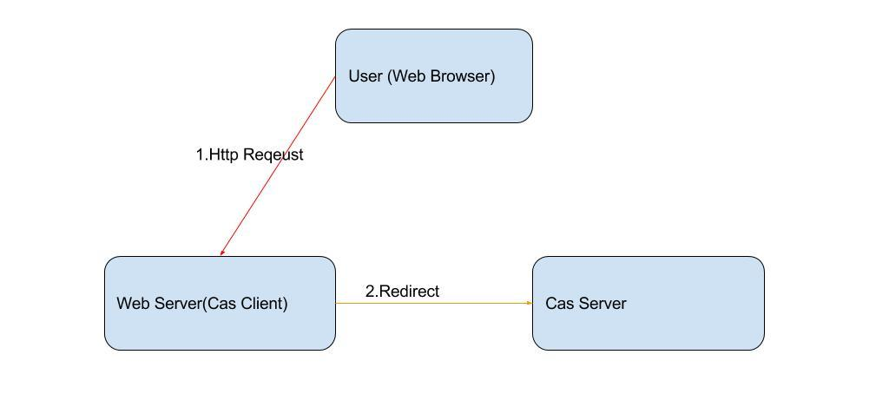
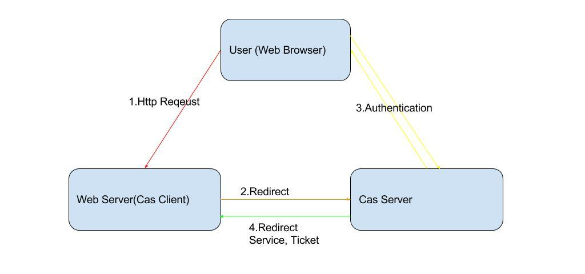

=======================================================
Cas
=======================================================
Central Authentication Service 是开源的单点登录解决方案。

Cas介绍
=======================================================
支持的协议：Protocols ： Custom Protocol 、 CAS 、 OAuth 、 OpenID 、 RESTful API 、 SAML1.1 、 SAML2.0。
支持的认证机制：Active Directory 、 JAAS 、 JDBC 、 LDAP 、 X.509 Certificates。
安全策略：使用票据（ Ticket ）来实现支持的认证协议；
支持授权：可以决定哪些服务可以请求和验证服务票据（ Service Ticket ）；
提供高可用性：通过把认证过的状态数据存储在 TicketRegistry 组件中，这些组件有很多支持分布式环境的实现，
如： BerkleyDB 、 Default 、 EhcacheTicketRegistry 、 JDBCTicketRegistry 、 JBOSS TreeCache 、 JpaTicketRegistry 、 MemcacheTicketRegistry 等；
支持多种客户端： Java, .Net, PHP, Perl, Apache, uPortal 等。

Cas流程
========================================================
Cas的访问流程分为几个步骤：

1. 用户访问Cas保护的资源时，部署在客户Web应用的AuthenticationFilter，会截获此请求，生成service参数，然后redirect到CAS服务的login接口，
   例如：https://casserverurl/cas/login?service=http://webserver/j_spring_cas_security_check；



2. 用户与Cas Server进行交互，进行身份认证，认证成功后，CAS服务器会生成认证cookie，写入浏览器，同时将cookie缓存到服务器本地，
   并为客户端浏览器设置一个 Ticket Granted Cookie（TGC），CAS 服务器还会根据service 参数生成ticket,ticket会保存到服务器，
   也会加在url后面，然后将请求redirect回客户Web服务器，
   例如：http://webserver/webapp/j_spring_cas_security_check?ticket=ST-0-ER94xMJmn6pha35CQRoZ；



3. Web应用的CasAuthenticationFilter会监听上述请求，看到ticket参数后，会跳过，传给AuthenticationManager进行处理，也就是配置中的CasAuthenticationProvider，
   由里面配置的的TicketValidationFilter处理，TicketValidationFilter会发送请求到Cas Server的/serviceValidate接口, 将ticket、service都传到此接口，
   由此接口验证ticket的有效性，之后Cas Server会给出响应，如果成功的话响应中会包含UserName；

.. image:: images/cas_process3.jpg

4. 至此为止，SSO会话就建立起来了，以后用户在同一浏览器里访问此web应用时，AuthenticationFilter会在session里读取到用户信息，所以就不会去CAS认证，
   如果在此浏览器里访问别的web 应用时，AuthenticationFilter在session 里读取不到用户信息，会去CAS 的login接口认证，但这时CAS会读取到浏览器传来的cookie，
   所以CAS不会要求用户去登录页面登录，只是会根据service参数生成一个ticket ，然后再和web应用做一个验证ticket的交互而已。

Cas Filter处理逻辑
=========================================================


最佳实践
=========================================================
用户在一个应用验证通过后，以后用户在同一浏览器里访问此应用时，客户端应用中的过滤器会在 session 里读取到用户信息，
所以就不会去CAS Server认证。如果在此浏览器里访问别的web应用时，客户端应用中的过滤器在 session 里读取不到用户信息，
就会去CAS Server的login接口认证，但这时CAS Server会读取到浏览器传来的cookie （ TGC ），所以CAS Server不会要求用户去登录页面登录，
只是会根据 service参数生成一个ticket，然后再和web应用做一个验证ticket的交互而已。

使用自己的Handler来处理登录登出
---------------------------------------------------------

Spring通过如下配置文件进行配置Cas Client:
~~~~~~~~~~~~~~~~~~~~~~~~~~~~~~~~~~~~~~~~~~~~~~~~~~~~~~~~~

.. code::

    <!-- 声明Cas认证切入点，并声明默认配置为false，以加入自己的定制 -->
    <security:http entry-point-ref="casAuthenticationEntryPoint" auto-config="false">
        <!-- 声明被保护的资源，注意顺序，并加入spring security的权限管理 -->
        <security:intercept-url pattern="/checkauthority.do" access="IS_AUTHENTICATED_ANONYMOUSLY" />
        <security:intercept-url pattern="/\**/\*.cas" access="ROLE_USER,ROLE_DOCTOR" />

        <!-- 如果声明默认配置为true，可以仅指定logout-success-url，其余都有默认初始值 --> 
        <security:logout logout-success-url="${cas.securityContext.casProcessingFilterEntryPoint.logoutUrl}?service=${index.url}" /> -->
        <security:custom-filter ref="concurrencyFilter" position="CONCURRENT_SESSION_FILTER" />
        <security:custom-filter ref="casAuthenticationFilter" position="CAS_FILTER"/>
        <security:custom-filter ref="singleLogoutFilter" before="CAS_FILTER"/>
        <security:custom-filter ref="requestSingleLogoutFilter" position="LOGOUT_FILTER"/>
    </security:http>

    <bean id="casAuthenticationEntryPoint" class="org.springframework.security.cas.web.CasAuthenticationEntryPoint">
        <property name="loginUrl" value="${cas.securityContext.casProcessingFilterEntryPoint.loginUrl}"/>
        <property name="serviceProperties" ref="serviceProperties"></property>
    </bean>

    <bean id="serviceProperties" class="org.springframework.security.cas.ServiceProperties">
        <property name="service" value="${cas.securityContext.serviceProperties.service}" />
        <property name="sendRenew" value="false" />
    </bean>

    <security:authentication-manager alias="authenticationManager">
        <security:authentication-provider ref="casAuthenticationProvider"/>
    </security:authentication-manager>

    <bean id="casAuthenticationProvider" class="org.springframework.security.cas.authentication.CasAuthenticationProvider">
        <property name="authenticationUserDetailsService" ref="authenticationUserDetailsService" />
        <property name="serviceProperties" ref="serviceProperties"></property>
        <property name="ticketValidator">
            <bean class="org.jasig.cas.client.validation.Cas20ServiceTicketValidator">
                <constructor-arg index="0" value="${cas.securityContext.ticketValidator.casServerUrlPrefix}"></constructor-arg>
            </bean>
        </property>
        <property name="key" value="an_id_for_this_auth_provider_only"></property>
    </bean>

    <bean id="casAuthenticationFilter" class="org.springframework.security.cas.web.CasAuthenticationFilter">
        <property name="authenticationManager" ref="authenticationManager"/> 
        <property name="authenticationSuccessHandler" ref="authenticationSuccessHandler"/>
    </bean>

    <bean id="authenticationSuccessHandler" class="com.xikang.ch.cas.MyAuthenticationSuccessHandler">
        <property name="alwaysUseDefaultTargetUrl" value="true" />
        <property name="defaultTargetUrl" value="${index.url}" />
        <property name="serverName" value="${ch.domain}" />
    </bean>

    <bean id="concurrencyFilter" class="org.springframework.security.web.session.ConcurrentSessionFilter">  
        <property name="sessionRegistry" ref="sessionRegistry" />  
        <property name="expiredUrl" value="${cas.securityContext.casProcessingFilterEntryPoint.logoutUrl}" />  
    </bean> 

    <bean id="sessionRegistry" class="org.springframework.security.core.session.SessionRegistryImpl" />

    <bean id="authenticationUserDetailsService" class="com.xikang.ch.cas.GrantedAuthorityFromAssertionAttributesXKUserDetailsService">
        <constructor-arg>
            <array>
                <value>authorities</value>
            </array>
        </constructor-arg>
    </bean>
    <bean id="proxyGrantingTicketStorage" class="org.jasig.cas.client.proxy.ProxyGrantingTicketStorageImpl" />

    <!--登出配置-->

    <bean id="singleLogoutFilter" class="org.jasig.cas.client.session.SingleSignOutFilter"/>

    <bean id="requestSingleLogoutFilter" class="org.springframework.security.web.authentication.logout.LogoutFilter">
        <constructor-arg value="${cas.securityContext.casProcessingFilterEntryPoint.logoutUrl}" />
        <constructor-arg>
            <!-- <bean class="org.springframework.security.web.authentication.logout.SecurityContextLogoutHandler" /> -->
            <bean class="com.xikang.cn.cas.MySecrityContextLogouthandler"/>
        </constructor-arg>
        <property name="filterProcessesUrl" value="/j_spring_security_logout" />
    </bean>

Spring cas关键代码
~~~~~~~~~~~~~~~~~~~~~~~~~~~~~~~~~~~~~~~~~~~~~~~~~~~~~~~~~~~

当用户访问一个被SpringSecurity保护的资源时，会抛出AccessDeniedException或者AuthenticationException，
就会被ExceptionTranslationFilter类探测并解惑；

org.springframework.security.web.access.ExceptionTranslationFilter:
```````````````````````````````````````````````````````````````````````````````````````````````````````````
.. code:: java

    public class ExceptionTranslationFilter extends GenericFilterBean {

        private AccessDeniedHandler accessDeniedHandler = new AccessDeniedHandlerImpl();
        //认证的切面入口点，这里是casAuthenticationEntryPoint
        private AuthenticationEntryPoint authenticationEntryPoint;
        private AuthenticationTrustResolver authenticationTrustResolver = new AuthenticationTrustResolverImpl();
        private ThrowableAnalyzer throwableAnalyzer = new DefaultThrowableAnalyzer();
        private RequestCache requestCache = new HttpSessionRequestCache();

        public void doFilter(ServletRequest req, ServletResponse res, FilterChain chain)
                throws IOException, ServletException {
            HttpServletRequest request = (HttpServletRequest) req;
            HttpServletResponse response = (HttpServletResponse) res;
            try{
                chain.doFilter(request, response);
                logger.debug("Chain processed normally");
            }catch (IOException ex) {
                throw ex;
            }catch (Exception ex) {
                // Try to extract a SpringSecurityException from the stacktrace
                Throwable[] causeChain = throwableAnalyzer.determineCauseChain(ex);
                RuntimeException ase = (AuthenticationException) throwableAnalyzer.getFirstThrowableOfType(AuthenticationException.class, causeChain);
                if (ase == null) {
                    ase = (AccessDeniedException)throwableAnalyzer.getFirstThrowableOfType(AccessDeniedException.class, causeChain);
                }
                if (ase != null) {
                    handleSpringSecurityException(request, response, chain, ase);
                }else {
                    // Rethrow ServletExceptions and RuntimeExceptions as-is
                    if (ex instanceof ServletException) {
                        throw (ServletException) ex;
                    }else if (ex instanceof RuntimeException) {
                        throw (RuntimeException) ex;
                    }
                    // Wrap other Exceptions. This shouldn't actually happen
                    // as we've already covered all the possibilities for doFilter''
                    throw new RuntimeException(ex);
                }
            }
        }
        private void handleSpringSecurityException(HttpServletRequest request, HttpServletResponse response, FilterChain chain,
                RuntimeException exception) throws IOException, ServletException {
            if (exception instanceof AuthenticationException) {
                logger.debug("Authentication exception occurred; redirecting to authentication entry point", exception);
                sendStartAuthentication(request, response, chain, (AuthenticationException) exception);
            }else if (exception instanceof AccessDeniedException) {
                if (authenticationTrustResolver.isAnonymous(SecurityContextHolder.getContext().getAuthentication())) {
                    logger.debug("Access is denied (user is anonymous); redirecting to authentication entry point", exception);
                    sendStartAuthentication(request, response, chain, new InsufficientAuthenticationException(
                                            "Full authentication is required to access this resource"));
                } else {
                    logger.debug("Access is denied (user is not anonymous); delegating to AccessDeniedHandler", exception);
                    accessDeniedHandler.handle(request, response, (AccessDeniedException) exception);
                }
            }
        }
        protected void sendStartAuthentication(HttpServletRequest request, HttpServletResponse response, FilterChain chain,
                AuthenticationException reason) throws ServletException, IOException {
            SecurityContextHolder.getContext().setAuthentication(null);
            requestCache.saveRequest(request, response);
            logger.debug("Calling Authentication entry point.");
            //这里根据authenticationEntryPoint的具体类型重定向到其中的认证页面
            authenticationEntryPoint.commence(request, response, reason);
        }
    }

Cas Client通过TicketValidationFilter来验证ticket的有效性；

org.jasig.cas.client.validation.AbstractTicketValidationFilter:
```````````````````````````````````````````````````````````````````````````````````````````````````````````
.. code:: java

     public final void doFilter(final ServletRequest servletRequest, final ServletResponse servletResponse, 
        final FilterChain filterChain) throws IOException, ServletException {
        if (!preFilter(servletRequest, servletResponse, filterChain)) {
            return;
        }
        final HttpServletRequest request = (HttpServletRequest) servletRequest;
        final HttpServletResponse response = (HttpServletResponse) servletResponse;
        final String ticket = CommonUtils.safeGetParameter(request, getArtifactParameterName());
        if (CommonUtils.isNotBlank(ticket)) {
            if (log.isDebugEnabled()) {
                log.debug("Attempting to validate ticket: " + ticket);
            }
            try{
                final Assertion assertion = this.ticketValidator.validate(ticket, constructServiceUrl(request, response));
                if (log.isDebugEnabled()) {
                    log.debug("Successfully authenticated user: " + assertion.getPrincipal().getName());
                }
                request.setAttribute(CONST_CAS_ASSERTION, assertion);
                if (this.useSession) {
                    request.getSession().setAttribute(CONST_CAS_ASSERTION, assertion);
                }
                onSuccessfulValidation(request, response, assertion);
            }catch (final TicketValidationException e) {
                response.setStatus(HttpServletResponse.SC_FORBIDDEN);
                log.warn(e, e);
                onFailedValidation(request, response);
                if (this.exceptionOnValidationFailure) {
                    throw new ServletException(e);
                }
            }
            if (this.redirectAfterValidation) {
                log. debug("Redirecting after successful ticket validation.");
                response.sendRedirect(response.encodeRedirectURL(constructServiceUrl(request, response)));
                return;
            }
        }
        filterChain.doFilter(request, response);
     }

Cas Client通过CasAuthenticationFilter来监听/j_spring_cas_security_check的请求，进行认证后的filter工作；

org.springframework.security.web.authentication.AbstractrAuthenticationProcessingFilter:
````````````````````````````````````````````````````````````````````````````````````````````````````````````
.. code:: java

    public void doFilter(ServletRequest req, ServletResponse res, FilterChain chain) throws IOException, ServletException {
        HttpServletRequest request = (HttpServletRequest) req;
        HttpServletResponse response = (HttpServletResponse) res;
        if (!requiresAuthentication(request, response)) {
            chain.doFilter(request, response);
            return;
        }
        if (logger.isDebugEnabled()) {
            logger.debug("Request is to process authentication");
        }
        Authentication authResult;
        try {
            authResult = attemptAuthentication(request, response);
            if (authResult == null) {
                // return immediately as subclass has indica ted that it hasn't completed authentication
                return;
            }
            sessionStrategy.onAuthentication(authResult, request, response);
        }catch(InternalAuthenticationServiceException failed) {
            logger.error("An internal error occurred while trying to authenticate the user.", failed);
            unsuccessfulAuthentication(request, response, failed);
            return;
        }catch (AuthenticationException failed) {
            unsuccessfulAuthentication(request, response, failed);
            return;
        }
        //Authentication success
        if (continueChainBeforeSuccessfulAuthentication) {
            chain.doFilter(request, response);
        }

        successfulAuthentication(request, response, chain, authResult);
    }

    protected void successfulAuthentication(HttpServletRequest request, HttpServletResponse response, FilterChain chain,
                Authentication authResult) throws IOException, ServletException{
        successfulAuthentication(request, response, authResult);
    }
    
    @Deprecated
    protected void successfulAuthentication(HttpServletRequest request, HttpServletResponse response,
            Authentication authResult) throws IOException, ServletException {
        if (logger.isDebugEnabled()) {
            logger.debug("Authentication success. Updating SecurityContextHolder to contain: " + authResult);
        }
        SecurityContextHolder.getContext().setAuthentication(authResult);
        rememberMeServices.loginSuccess(request, response, authResult);
        if (this.eventPublisher != null) {
            eventPublisher.publishEvent(new InteractiveAuthenticationSuccessEvent(authResult, this.getClass()));
        }
        successHandler.onAuthenticationSuccess(request, response, authResult);
    }

通过继承SimpleUrlAuthenticationSuccessHandler来实现自己的登录后逻辑；

org.springframework.security.web.authentication.SimpleUrlAuthenticationSuccessHandler
`````````````````````````````````````````````````````````````````````````````````````````````````````````````````
.. code:: java

    public void onAuthenticationSuccess(HttpServletRequest request, HttpServletResponse response,
            Authentication authentication) throws IOException, ServletException {
        handle(request, response, authentication);
        clearAuthenticationAttributes(request);
    }

    protected final void clearAuthenticationAttributes(HttpServletRequest request) {
        HttpSession session = request.getSession(false);
        if(session == null){
            return;
        }
        session.removeAttribute(WebAttributes.AUTHENTICATION_EXCEPTION);
    }

    //父类方法
    protected void handle(HttpServletRequest request, HttpServletResponse response, Authentication authentication)
            throws IOException, ServletException {
        String targetUrl = determineTargetUrl(request, response);
        if (response.isCommitted()) {
            logger.debug("Response has already been committed. Unable to redirect to " + targetUrl);
            return;
        }
        redirectStrategy.sendRedirect(request, response, targetUrl);
    }

通过继承AbstractCasAssertionUserDetailsService来实现用户权限分配；

org.springframework.security.cas.userdetails.AbstractCasAssertionUserDetailsService
`````````````````````````````````````````````````````````````````````````````````````````````````````````````````

.. code:: java
    
    //认证成功后回调，返回用户Code的方法
    public abstract class AbstractCasAssertionUserDetailsService implements AuthenticationUserDetailsService{
        public final UserDetails loadUserDetails(final Authentication token) throws UsernameNotFoundException {
            Assert.isInstanceOf(CasAssertionAuthenticationToken.class, token, "The provided token MUST be an instance of CasAssertionAuthenticationToken.class");
            return loadUserDetails(((CasAssertionAuthenticationToken) token).getAssertion());
        }
    }
    //空方法，需要继承实现，来编写自己的逻辑
    protected abstract UserDetails loadUserDetails(Assertion assertion);

通过继承SecurityContextLogoutHandler并注入到LogoutFilter来实现自己的用户登出逻辑，这里可以使用多个Handler；

org.springframework.security.web.authentication.logout.LogoutFilter:
`````````````````````````````````````````````````````````````````````````````````````````````````````````````````

.. code:: java

    public LogoutFilter(String logoutSuccessUrl, LogoutHandler... handlers) {
        Assert.notEmpty(handlers, "LogoutHandlers are required");
        this.handlers = Arrays.asList(handlers);
        Assert.isTrue(!StringUtils.hasLength(logoutSuccessUrl) || UrlUtils.isValidRedirectUrl(logoutSuccessUrl), logoutSuccessUrl + " isn't a valid redirect URL");
        SimpleUrlLogoutSuccessHandler urlLogoutSuccessHandler = new SimpleUrlLogoutSuccessHandler();
        if (StringUtils.hasText(logoutSuccessUrl)) {
            urlLogoutSuccessHandler.setDefaultTargetUrl(logoutSuccessUrl);
        }
        logoutSuccessHandler = urlLogoutSuccessHandler;
        setFilterProcessesUrl("/j_spring_security_logout");
    }
    public void doFilter(ServletRequest req, ServletResponse res, FilterChain chain) throws IOException, ServletException {
        HttpServletRequest request = (HttpServletRequest) req;
        HttpServletResponse response = (HttpServletResponse) res;
        if (requiresLogout(request, response)) {
            Authentication auth = SecurityContextHolder.getContext().getAuthentication();
            if (logger.isDebugEnabled()) {
                logger.debug("Logging out user '" + auth + "' and transferring to logout destination");
            }
            for (LogoutHandler handler : handlers) {
                handler.logout(request, response, auth);
            }
            logoutSuccessHandler.onLogoutSuccess(request, response, auth);
            return;
        }
        chain.doFilter(request, response);
    }


参考资料
===========================================================
http://docs.spring.io/spring-security/site/docs/3.1.6.RELEASE/reference/cas.html
https://www.ibm.com/developerworks/cn/opensource/os-cn-cas/
http://blog.csdn.net/dongdong_java/article/details/22293377

