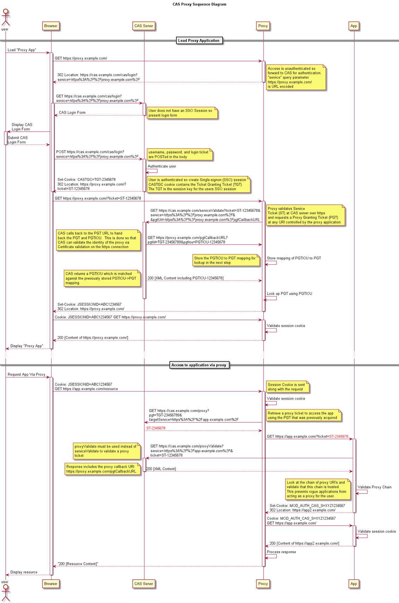

=======================================================
Cas
=======================================================
Central Authentication Service 是开源的单点登录解决方案，本身是一套框架，底层预留出接口进行认证，支持多种认证方式，Cas Client和Cas Server之间
的通讯协议也是支持Cas，OpenId，SAML，Oauth等。

Cas介绍
=======================================================
Cas Server: authenticate users, grant access to CAS-enabled services, issue and validate tickets, create sso session;

Cas Client: communicate with CAS server via a supported protocol,  can be integrated with various software platforms and applications;

支持的协议（Protocols）： Custom Protocol 、 CAS 、 OAuth 、 OpenID 、 RESTful API 、 SAML1.1 、 SAML2.0。

支持的认证机制：Active Directory 、 JAAS 、 JDBC 、 LDAP 、 X.509 Certificates。

安全策略：使用票据（Ticket）来实现支持的认证协议；

支持授权：可以决定哪些服务可以请求和验证服务票据（Service Ticket）；

提供高可用性：通过把认证过的状态数据存储在 TicketRegistry 组件中，这些组件有很多支持分布式环境的实现，
如： BerkleyDB 、 Default 、 EhcacheTicketRegistry 、 JDBCTicketRegistry 、 JBOSS TreeCache 、 JpaTicketRegistry 、 MemcacheTicketRegistry 等；

支持多种客户端： Java, .Net, PHP, Perl, Apache, uPortal 等。

.. image:: images/cas_architecture.png

相关概念
--------------------------------------------------------

TGT: Ticket Granting Ticket;

TGC: Ticket Granting Cookie, TGT in client browser;

ST: Service Ticket;

Credentials：用户提供的用于登录用的凭据信息，如用户名/密码、证书、IP地址、Cookie值等。比如UsernamePasswordCredentials，封装的是用户名和密码。
CAS进行认证的第一步，就是把从UI或request对象里取到的用户凭据封装成Credentials对象，然后交给认证管理器去认证；

AuthenticationHandler：认证Handler, 每种AuthenticationHandler只能处理一种Credentials；

Principal：封装用户标识，比如SimplePrincipal, 只是封装了用户名。认证成功后，credentialsToPrincipalResolvers负责由Credentials生成Principal对象；

CredentialsToPrincipalResolvers：负责由Credentials生成Principal对象，每种CredentialsToPrincipalResolvers 只处理一种Credentials，
比如UsernamePasswordCredentialsToPrincipalResolver负责从UsernamePasswordCredentials中取出用户名，然后将其赋给生成的SimplePrincipal的ID属性；

AuthenticationMetaDataPopulators：负责将Credentials的一些属性赋值给Authentication的attributes属性；

Authentication：Authentication是认证管理器的最终处理结果， Authentication封装了Principal，认证时间，及其他一些属性（可能来自Credentials）；

AuthenticationManager：认证管理器得到Credentials对象后，负责调度AuthenticationHandler去完成认证工作，最后返回的结果是Authentication对象；

CentralAuthenticationService：CAS的服务类，对Web层提供了一些方法。该类还负责调用AuthenticationManager完成认证逻辑；

Cas流程
========================================================
Cas的访问流程分为几个步骤：

1. 用户访问Cas保护的资源时，部署在客户Web应用的ExceptionTranslationFilter，会截获此请求，生成service参数，然后redirect到CAS服务的login接口，
   例如：https://$casserverurl/cas/login?service=http://$webserver/webapp/j_spring_cas_security_check;

.. image:: images/cas_process1.jpg

2. 用户与Cas Server进行交互，进行身份认证，认证成功后，CAS服务器会生成认证cookie，写入浏览器，同时将SSO session存到服务器本地，
   并为客户端浏览器设置一个 Ticket Granted Cookie（TGC），CAS 服务器还会根据service 参数生成ticket,ticket会保存到服务器，
   也会加在url后面，然后将请求redirect回客户Web服务器，
   例如：http://$webserver/webapp/j_spring_cas_security_check?ticket=ST-0-ER94xMJmn6pha35CQRoZ;

.. image:: images/cas_process2.jpg

3. Web应用的CasAuthenticationFilter会监听上述请求，看到ticket参数后，会跳过，传给AuthenticationManager进行处理，也就是配置中的CasAuthenticationProvider，
   由里面配置的的TicketValidationFilter处理，TicketValidationFilter会发送请求到Cas Server的/serviceValidate接口, 将ticket、service都传到此接口，
   由此接口验证ticket的有效性，之后Cas Server会给出响应，如果成功的话响应中会包含UserName；
   例如：http://$casserverurl/cas/serviceValidate?ticket=ST-0-ER94xMJmn6pha35CQRoZ&service=$serviceurl;

.. image:: images/cas_process3.jpg

4. 至此为止，SSO就建立起来了，以后用户在同一浏览器里访问此web应用时，AuthenticationFilter会在session里读取到用户信息，所以就不会去CAS认证，
   如果在此浏览器里访问别的web 应用时，AuthenticationFilter在session 里读取不到用户信息，会去CAS 的login接口认证，但这时CAS会读取到浏览器传来的cookie，
   所以CAS不会要求用户去登录页面登录，只是会根据service参数生成一个ticket ，然后再和web应用做一个验证ticket的交互而已；

5. Cas登出时，由requestSingleLogoutFilter访问/spring_security_cas_logout重定向到Cas Server来进行登出，再由Cas Server发送一个Single Logout Request到所有
   注册的服务中，singleLogoutFilter处理这个Single Logout Request，从静态Map中查找Session并将其置为无效。

6. 整体流程图：

.. image:: images/cas_flow_diagram.png

代理流程：

Cas HA Deployment
=========================================================
简单环境，建议使用云平台进行HA，使用Active/Standby方式，这样ticket信息和ticket registry都存储在内存之中，简单有效，不能做到用户零
感知升级和切换，而且切换后会丢失SSO session，导致重新登录。

集群环境，可分为Active/Standby和Active/Active，当使用Active/Active模式时，需要将ticket和ticket registry存储在共享存储上，并使用LBS
的心跳机制，session共享是可选的，但并不推荐，建议使用LBS的source IP方式（大NAT环境下不建议），并提供冗余的服务，Session复制复杂而
不可靠，有安全泄漏的风险。
Active/Standby模式下，切换的时候可能会导致票据验证不通过，这个时候需要重新登录。

.. image:: images/ha_architecture.png

Cas Security
=========================================================
主要思想为宁可牺牲用户体验，也要保证ticket，session安全。

1. 为了减少帐号密码暴露的风险，所有与Cas Server的交互都建议使用https方式，包括Cas server与底层的认证服务交互，与用户或Cas client的
   交互；
2. 不建议使用缓存集群进行同步和复制ticket信息，同时持久化也应该加密；
3. 对于关键应用使用Force Authentication机制；
4. 对于信任ip可使用Passive Authentication机制；
5. 当使用代理模式时对代理链进行验证；
6. 尽量缩短app的session timeout和SSO session的timeout，防止退出出错时造成安全风险；
7. 支持login throttling，但建议使用认证服务器自身的throttling；
8. 对于long term session，使用Force Authentication进行保护；

Zabbix组件
Zabbix Server：负责接收agent发送的报告信息的核心组件，所有配置、统计数据及操作数据均由其组织进行
Database Storage：专用于存储所有配置信息，以及有zabbix收集的数据
Web interface（frontend）：zabbix的GUI接口，通常与server运行在同一台机器上
Proxy：可选组件，常用于分布式监控环境中，代理Server收集部分被监控数据并统一发往Server端
Agent：部署在被监控主机上，负责收集本地数据并发往Server端或者Proxy端

CAS Server搭建（5.3.X）
=======================================
新版本的CasServer是基于Spring Boot开发的，因此配置起来和之前有比较大的区别，主要集中在初始化配置部分。

.. code::

    调试时请务必修改service ticket的有效时间，否则在利用调试功能解析协议的时候，一定会由于超时而导致验证ticket失败。

1. 自定义配置
---------------------------------------
建立spring.factories，将自定义的@Configuration文件放入其中

.. code::

    org.springframework.boot.autoconfigure.EnableAutoConfiguration=\
    org.apereo.cas.config.CasEmbeddedContainerTomcatConfiguration,\
    org.apereo.cas.config.CasEmbeddedContainerTomcatFiltersConfiguration,\
    com.neusoft.cbus.cas.config.CbusScanConfig

2. 自定义认证策略
---------------------------------------

官网给出的自定义认证策略代码有问题，首先建立自己的认证handler，继承自AbstractUsernamePasswordAuthenticationHandler，

.. code::
    
    //MyAuthenticationHandler.class
    public class MyAuthenticationHandler extends AbstractUsernamePasswordAuthenticationHandler {
    public MyAuthenticationHandler(String name, ServicesManager servicesManager, PrincipalFactory principalFactory, Integer order) {
        super(name, servicesManager, principalFactory, order);
    }

    @Override
    protected AuthenticationHandlerExecutionResult authenticateUsernamePasswordInternal(final UsernamePasswordCredential credential,
                                                                                        final String originalPassword) {
        UsernamePasswordCredential usernamePasswordCredential = (UsernamePasswordCredential) credential;
        //获取传递过来的用户名和密码
        String username = usernamePasswordCredential.getUsername();
        String password = usernamePasswordCredential.getPassword();
        
        Map<String,Object> map = new HashMap<String, Object>();
        map.put("username",username);
        map.put("password",password);
        return createHandlerResult(credential,principalFactory.createPrincipal("hello",map),new ArrayList<>(0));
    }
    
.. code::

    注意createHandlerResult的最后一个参数warnings，不能传null，如果传null则会抛出异常，导致当前handler失效，又会被默认的
    AcceptUsersAuthenticationHandler接收进行再次认证，这样就覆盖了当前自己写的设置属性的方法。

在自定义认证中，必须将自定义的handerl加入到认证执行计划中，通过实现AuthenticationEventExecutionPlanConfigurer进行设置。
初始化handler时，必须使用上下文中的serviceManager，还有principalFactory（可以使用null或者DefaultPrincipalFactory），
最后的order指定为1，这样handler上下文优先使用我们自定的handler进行认证解析，默认的AcceptUsersAuthenticationHandlerhanderl的order是个大于1的随机数，
如果我们order设置的不合理，就会被默认的handler解析而跳过自定义的handler。

如果这个handler不能处理或者抛出异常，则上下文继续调用其他handler进行解析，以order的顺序。

.. code:: java

    //CbusScanConfig.class
    @Autowired
    @Qualifier("servicesManager")
    private ServicesManager servicesManager;
    
    @Bean
    public AuthenticationHandler myAuthenticationHandler(){
        final MyAuthenticationHandler handler = new MyAuthenticationHandler(MyAuthenticationHandler.class.getName(),servicesManager,new DefaultPrincipalFactory(),1);
        return handler;
    }

    @Override
    public void configureAuthenticationExecutionPlan(AuthenticationEventExecutionPlan authenticationEventExecutionPlan) {
        authenticationEventExecutionPlan.registerAuthenticationHandler(myAuthenticationHandler());
    }
    
不要看官网写的代码，上面不知道哪个大神修改的，那个代码只能拿来看意思，并不能直接使用。

    
3. 设置属性返回策略
---------------------------------------

返回所有属性，name和id组成这个文件的名字，cbus_10000.json

.. code::

    {
      "@class": "org.apereo.cas.services.RegexRegisteredService",
      "serviceId": "^(https|imaps|http)://127.0.0.1.*",
      "name": "cbus",
      "description" : "asaaaaaaaaaaa.",
      "id": 1000,
      "evaluationOrder": 10,
      "attributeReleasePolicy" : {
        "@class" : "org.apereo.cas.services.ReturnAllAttributeReleasePolicy"
      }
    }

4. 修改客户端协议
---------------------------------------
当实现了一切接口以后，还是不能返回自定义属性，根据官方文档，自定义属性的返回在serverValidate服务中返回，在调试时我重点看验证ST的返回，
在response中怎么也没有属性的字段，以为是attributeReleasePolicy，在server端调试，发现server端代码没有问题，一切都按带属性的principal进行返回。

原来，在2.0协议中，只能返回username和pgt的属性，再仔细看官方文档，说只有cas3.0才能有自定义属性返回。调试时手动修改cas协议url，
发现service ticket无效，还是中了有效时间的坑。直接改为Cas30ServiceTicketValidator进行票据解析，其实这个类继承自Cas20ServiceTicketValidator，

最后，直接改为Cas30ServiceTicketValidator进行票据解析，其实这个类继承自Cas20ServiceTicketValidator，
唯一的不同就是getUrlSuffix()返回的是带有p3协议的url前缀。

.. code::

    @Configuration
    @EnableWebSecurity //启用web权限
    @EnableGlobalMethodSecurity(prePostEnabled = true) //启用方法验证
    public class SecurityConfig extends WebSecurityConfigurerAdapter {
        @Autowired
        private CasProperties casProperties;
        @Override
        protected void configure(AuthenticationManagerBuilder auth) throws Exception {
            super.configure(auth);
            auth.authenticationProvider(casAuthenticationProvider());
        }

        @Override
        protected void configure(HttpSecurity http) throws Exception {
            http.authorizeRequests()//配置安全策略
                    .anyRequest().authenticated()//其余的所有请求都需要验证
                    .and()
                    .logout()
                    .permitAll()//定义logout不需要验证
                    .and()
                    .formLogin();//使用form表单登录
            http.exceptionHandling().authenticationEntryPoint(casAuthenticationEntryPoint());
            http.addFilter(casAuthenticationFilter())
                    .addFilterBefore(casLogoutFilter(), LogoutFilter.class)
                    .addFilterBefore(singleSignOutFilter(), CasAuthenticationFilter.class);
        }

        @Bean
        public CasAuthenticationEntryPoint casAuthenticationEntryPoint() {
            CasAuthenticationEntryPoint casAuthenticationEntryPoint = new CasAuthenticationEntryPoint();
            casAuthenticationEntryPoint.setLoginUrl(casProperties.getCasServerLoginUrl());
            casAuthenticationEntryPoint.setServiceProperties(serviceProperties());
            return casAuthenticationEntryPoint;
        }

        @Bean
        public ServiceProperties serviceProperties() {
            ServiceProperties serviceProperties = new ServiceProperties();
            serviceProperties.setService(casProperties.getAppServerUrl() + casProperties.getAppLoginUrl());
            serviceProperties.setAuthenticateAllArtifacts(true);
            return serviceProperties;
        }

        @Bean
        public CasAuthenticationFilter casAuthenticationFilter() throws Exception {
            System.out.println("**********"+casProperties.getAppLoginUrl());
            CasAuthenticationFilter casAuthenticationFilter = new CasAuthenticationFilter();
            casAuthenticationFilter.setAuthenticationManager(authenticationManager());
            casAuthenticationFilter.setContinueChainBeforeSuccessfulAuthentication(false);
            casAuthenticationFilter.setFilterProcessesUrl(casProperties.getAppLoginUrl());
            System.out.println("**********"+casAuthenticationFilter.getFilterConfig());
            return casAuthenticationFilter;
        }

        @Bean
        public CasAuthenticationProvider casAuthenticationProvider() {
            CasAuthenticationProvider casAuthenticationProvider = new CasAuthenticationProvider();
            casAuthenticationProvider.setAuthenticationUserDetailsService(customUserDetailsService());
            //casAuthenticationProvider.setUserDetailsService(customUserDetailsService()); //这里只是接口类型，实现的接口不一样，都可以的。
            casAuthenticationProvider.setServiceProperties(serviceProperties());
            casAuthenticationProvider.setTicketValidator(cas30ServiceTicketValidator());
            casAuthenticationProvider.setKey("casAuthenticationProviderKey");
            return casAuthenticationProvider;
        }

        @Bean
        public AuthenticationUserDetailsService<CasAssertionAuthenticationToken> customUserDetailsService() {
            return new CustomUserDetailsService();
        }

        @Bean
        public Cas30ServiceTicketValidator cas30ServiceTicketValidator() {
            return new Cas30ServiceTicketValidator(casProperties.getCasServerUrl());
        }

        @Bean
        public SingleSignOutFilter singleSignOutFilter() {
            SingleSignOutFilter singleSignOutFilter = new SingleSignOutFilter();
            singleSignOutFilter.setCasServerUrlPrefix(casProperties.getCasServerUrl());
            singleSignOutFilter.setIgnoreInitConfiguration(true);
            return singleSignOutFilter;
        }

        @Bean
        public LogoutFilter casLogoutFilter() {
            LogoutFilter logoutFilter = new LogoutFilter(casProperties.getCasServerLogoutUrl(), new SecurityContextLogoutHandler());
            logoutFilter.setFilterProcessesUrl(casProperties.getAppLogoutUrl());
            return logoutFilter;
        }
    }

.. code:: java

    @Override
    public UserDetails loadUserDetails(CasAssertionAuthenticationToken casAssertionAuthenticationToken) throws UsernameNotFoundException {
        User user = new User();
        String username = casAssertionAuthenticationToken.getName();
        Map<String,Object> map = casAssertionAuthenticationToken.getAssertion().getPrincipal().getAttributes();
        user.setLoginName(map.get("username").toString());
        return new MyUserDetails(user);
    }

最佳实践
==============================================================================================================
通过配置来实现自己的Handler

Spring配置文件:
---------------------------------------------------------------------------------------------------------------
web.xml

.. code::

    <!-- Wraps an HttpServletRequest so that the getRemoteUser and getPrincipal return the CAS related entries -->
    <filter>
        <filter-name>CAS HttpServletRequest Wrapper Filter</filter-name>
        <filter-class>org.jasig.cas.client.util.HttpServletRequestWrapperFilter</filter-class>
    </filter>
    <!-- Places the Assertion in a ThreadLocal for portions of the application that need access to it. This is useful when the Web application 
    that this filter "fronts" needs to get the Principal name, but it has no access to the HttpServletRequest, hence making getRemoteUser() call impossible -->
    <filter>
        <filter-name>CAS Assertion Thread Local Filter</filter-name>
        <filter-class>org.jasig.cas.client.util.AssertionThreadLocalFilter</filter-class>
    </filter>

spring-cas.xml

.. code::

    <!-- 声明Cas认证切入点，并声明默认配置为false，以加入自己的定制 -->
    <security:http entry-point-ref="casAuthenticationEntryPoint" auto-config="false">
        <!-- 声明被保护的资源，注意顺序，并加入spring security的权限管理 -->
        <security:intercept-url pattern="/checkauthority.do" access="IS_AUTHENTICATED_ANONYMOUSLY" />
        <security:intercept-url pattern="/\**/\*.cas" access="ROLE_USER,ROLE_DOCTOR" />

        <!-- 如果声明默认配置为true，可以仅指定logout-success-url，其余都有默认初始值 --> 
        <security:logout logout-success-url="${cas.securityContext.casProcessingFilterEntryPoint.logoutUrl}?service=${index.url}" /> -->
        <security:custom-filter ref="concurrencyFilter" position="CONCURRENT_SESSION_FILTER" />
        <security:custom-filter ref="casAuthenticationFilter" position="CAS_FILTER"/>
        <security:custom-filter ref="singleLogoutFilter" before="CAS_FILTER"/>
        <security:custom-filter ref="requestSingleLogoutFilter" position="LOGOUT_FILTER"/>
    </security:http>

    <bean id="casAuthenticationEntryPoint" class="org.springframework.security.cas.web.CasAuthenticationEntryPoint">
        <property name="loginUrl" value="${cas.securityContext.casProcessingFilterEntryPoint.loginUrl}"/>
        <property name="serviceProperties" ref="serviceProperties"></property>
    </bean>

    <bean id="serviceProperties" class="org.springframework.security.cas.ServiceProperties">
        <property name="service" value="${cas.securityContext.serviceProperties.service}" />
        <property name="sendRenew" value="false" />
    </bean>

    <security:authentication-manager alias="authenticationManager">
        <security:authentication-provider ref="casAuthenticationProvider"/>
    </security:authentication-manager>

    <bean id="casAuthenticationProvider" class="org.springframework.security.cas.authentication.CasAuthenticationProvider">
        <property name="authenticationUserDetailsService" ref="authenticationUserDetailsService" />
        <property name="serviceProperties" ref="serviceProperties"></property>
        <property name="ticketValidator">
            <!-- Validates the tickets using the CAS 2.0 protocol. If you provide either the acceptAnyProxy or the allowedProxyChains parameters, 
            a Cas20ProxyTicketValidator will be constructed. Otherwise a general Cas20ServiceTicketValidator will be constructed that does not accept proxy tickets -->
            <bean class="org.jasig.cas.client.validation.Cas20ServiceTicketValidator">
                <constructor-arg index="0" value="${cas.securityContext.ticketValidator.casServerUrlPrefix}"></constructor-arg>
            </bean>
        </property>
        <property name="key" value="an_id_for_this_auth_provider_only"></property>
    </bean>

    <bean id="casAuthenticationFilter" class="org.springframework.security.cas.web.CasAuthenticationFilter">
        <property name="authenticationManager" ref="authenticationManager"/> 
        <property name="authenticationSuccessHandler" ref="authenticationSuccessHandler"/>
    </bean>

    <bean id="authenticationSuccessHandler" class="com.xikang.ch.cas.MyAuthenticationSuccessHandler">
        <property name="alwaysUseDefaultTargetUrl" value="true" />
        <property name="defaultTargetUrl" value="${index.url}" />
        <property name="serverName" value="${ch.domain}" />
    </bean>

    <bean id="concurrencyFilter" class="org.springframework.security.web.session.ConcurrentSessionFilter">  
        <property name="sessionRegistry" ref="sessionRegistry" />  
        <property name="expiredUrl" value="${cas.securityContext.casProcessingFilterEntryPoint.logoutUrl}" />  
    </bean> 

    <bean id="sessionRegistry" class="org.springframework.security.core.session.SessionRegistryImpl" />

    <bean id="authenticationUserDetailsService" class="com.xikang.ch.cas.GrantedAuthorityFromAssertionAttributesXKUserDetailsService">
        <constructor-arg>
            <array>
                <value>authorities</value>
            </array>
        </constructor-arg>
    </bean>
    <bean id="proxyGrantingTicketStorage" class="org.jasig.cas.client.proxy.ProxyGrantingTicketStorageImpl" />

    <!--登出配置-->

    <bean id="singleLogoutFilter" class="org.jasig.cas.client.session.SingleSignOutFilter"/>

    <bean id="requestSingleLogoutFilter" class="org.springframework.security.web.authentication.logout.LogoutFilter">
        <constructor-arg value="${cas.securityContext.casProcessingFilterEntryPoint.logoutUrl}" />
        <constructor-arg>
            <!-- <bean class="org.springframework.security.web.authentication.logout.SecurityContextLogoutHandler" /> -->
            <bean class="com.xikang.cn.cas.MySecrityContextLogouthandler"/>
        </constructor-arg>
        <property name="filterProcessesUrl" value="/j_spring_security_logout" />
    </bean>

Spring cas client关键代码
-----------------------------------------------------------------------------------------------------------

当用户访问一个被SpringSecurity保护的资源时，会抛出AccessDeniedException或者AuthenticationException，
就会被ExceptionTranslationFilter类探测并解惑；

org.springframework.security.web.access.ExceptionTranslationFilter:

.. code:: java

    public class ExceptionTranslationFilter extends GenericFilterBean {

        private AccessDeniedHandler accessDeniedHandler = new AccessDeniedHandlerImpl();
        //认证的切面入口点，这里是casAuthenticationEntryPoint
        private AuthenticationEntryPoint authenticationEntryPoint;
        private AuthenticationTrustResolver authenticationTrustResolver = new AuthenticationTrustResolverImpl();
        private ThrowableAnalyzer throwableAnalyzer = new DefaultThrowableAnalyzer();
        private RequestCache requestCache = new HttpSessionRequestCache();

        public void doFilter(ServletRequest req, ServletResponse res, FilterChain chain)
                throws IOException, ServletException {
            HttpServletRequest request = (HttpServletRequest) req;
            HttpServletResponse response = (HttpServletResponse) res;
            try{
                chain.doFilter(request, response);
                logger.debug("Chain processed normally");
            }catch (IOException ex) {
                throw ex;
            }catch (Exception ex) {
                // Try to extract a SpringSecurityException from the stacktrace
                Throwable[] causeChain = throwableAnalyzer.determineCauseChain(ex);
                RuntimeException ase = (AuthenticationException) throwableAnalyzer.getFirstThrowableOfType(AuthenticationException.class, causeChain);
                if (ase == null) {
                    ase = (AccessDeniedException)throwableAnalyzer.getFirstThrowableOfType(AccessDeniedException.class, causeChain);
                }
                if (ase != null) {
                    handleSpringSecurityException(request, response, chain, ase);
                }else {
                    // Rethrow ServletExceptions and RuntimeExceptions as-is
                    if (ex instanceof ServletException) {
                        throw (ServletException) ex;
                    }else if (ex instanceof RuntimeException) {
                        throw (RuntimeException) ex;
                    }
                    // Wrap other Exceptions. This shouldn't actually happen
                    // as we've already covered all the possibilities for doFilter''
                    throw new RuntimeException(ex);
                }
            }
        }
        private void handleSpringSecurityException(HttpServletRequest request, HttpServletResponse response, FilterChain chain,
                RuntimeException exception) throws IOException, ServletException {
            if (exception instanceof AuthenticationException) {
                logger.debug("Authentication exception occurred; redirecting to authentication entry point", exception);
                sendStartAuthentication(request, response, chain, (AuthenticationException) exception);
            }else if (exception instanceof AccessDeniedException) {
                if (authenticationTrustResolver.isAnonymous(SecurityContextHolder.getContext().getAuthentication())) {
                    logger.debug("Access is denied (user is anonymous); redirecting to authentication entry point", exception);
                    sendStartAuthentication(request, response, chain, new InsufficientAuthenticationException(
                                            "Full authentication is required to access this resource"));
                } else {
                    logger.debug("Access is denied (user is not anonymous); delegating to AccessDeniedHandler", exception);
                    accessDeniedHandler.handle(request, response, (AccessDeniedException) exception);
                }
            }
        }
        protected void sendStartAuthentication(HttpServletRequest request, HttpServletResponse response, FilterChain chain,
                AuthenticationException reason) throws ServletException, IOException {
            SecurityContextHolder.getContext().setAuthentication(null);
            requestCache.saveRequest(request, response);
            logger.debug("Calling Authentication entry point.");
            //这里根据authenticationEntryPoint的具体类型重定向到其中的认证页面
            authenticationEntryPoint.commence(request, response, reason);
        }
    }

Cas Client通过TicketValidationFilter来验证ticket的有效性；

org.jasig.cas.client.validation.AbstractTicketValidationFilter:

.. code:: java

     public final void doFilter(final ServletRequest servletRequest, final ServletResponse servletResponse, 
        final FilterChain filterChain) throws IOException, ServletException {
        if (!preFilter(servletRequest, servletResponse, filterChain)) {
            return;
        }
        final HttpServletRequest request = (HttpServletRequest) servletRequest;
        final HttpServletResponse response = (HttpServletResponse) servletResponse;
        final String ticket = CommonUtils.safeGetParameter(request, getArtifactParameterName());
        if (CommonUtils.isNotBlank(ticket)) {
            if (log.isDebugEnabled()) {
                log.debug("Attempting to validate ticket: " + ticket);
            }
            try{
                final Assertion assertion = this.ticketValidator.validate(ticket, constructServiceUrl(request, response));
                if (log.isDebugEnabled()) {
                    log.debug("Successfully authenticated user: " + assertion.getPrincipal().getName());
                }
                request.setAttribute(CONST_CAS_ASSERTION, assertion);
                if (this.useSession) {
                    request.getSession().setAttribute(CONST_CAS_ASSERTION, assertion);
                }
                onSuccessfulValidation(request, response, assertion);
            }catch (final TicketValidationException e) {
                response.setStatus(HttpServletResponse.SC_FORBIDDEN);
                log.warn(e, e);
                onFailedValidation(request, response);
                if (this.exceptionOnValidationFailure) {
                    throw new ServletException(e);
                }
            }
            if (this.redirectAfterValidation) {
                log. debug("Redirecting after successful ticket validation.");
                response.sendRedirect(response.encodeRedirectURL(constructServiceUrl(request, response)));
                return;
            }
        }
        filterChain.doFilter(request, response);
     }

Cas Client通过CasAuthenticationFilter来监听/j_spring_cas_security_check的请求，进行认证后的filter工作；

org.springframework.security.web.authentication.AbstractrAuthenticationProcessingFilter:

.. code:: java

    public void doFilter(ServletRequest req, ServletResponse res, FilterChain chain) throws IOException, ServletException {
        HttpServletRequest request = (HttpServletRequest) req;
        HttpServletResponse response = (HttpServletResponse) res;
        if (!requiresAuthentication(request, response)) {
            chain.doFilter(request, response);
            return;
        }
        if (logger.isDebugEnabled()) {
            logger.debug("Request is to process authentication");
        }
        Authentication authResult;
        try {
            authResult = attemptAuthentication(request, response);
            if (authResult == null) {
                // return immediately as subclass has indica ted that it hasn't completed authentication
                return;
            }
            sessionStrategy.onAuthentication(authResult, request, response);
        }catch(InternalAuthenticationServiceException failed) {
            logger.error("An internal error occurred while trying to authenticate the user.", failed);
            unsuccessfulAuthentication(request, response, failed);
            return;
        }catch (AuthenticationException failed) {
            unsuccessfulAuthentication(request, response, failed);
            return;
        }
        //Authentication success
        if (continueChainBeforeSuccessfulAuthentication) {
            chain.doFilter(request, response);
        }

        successfulAuthentication(request, response, chain, authResult);
    }

    protected void successfulAuthentication(HttpServletRequest request, HttpServletResponse response, FilterChain chain,
                Authentication authResult) throws IOException, ServletException{
        successfulAuthentication(request, response, authResult);
    }
    
    @Deprecated
    protected void successfulAuthentication(HttpServletRequest request, HttpServletResponse response,
            Authentication authResult) throws IOException, ServletException {
        if (logger.isDebugEnabled()) {
            logger.debug("Authentication success. Updating SecurityContextHolder to contain: " + authResult);
        }
        SecurityContextHolder.getContext().setAuthentication(authResult);
        rememberMeServices.loginSuccess(request, response, authResult);
        if (this.eventPublisher != null) {
            eventPublisher.publishEvent(new InteractiveAuthenticationSuccessEvent(authResult, this.getClass()));
        }
        successHandler.onAuthenticationSuccess(request, response, authResult);
    }

通过继承SimpleUrlAuthenticationSuccessHandler来实现自己的登录后逻辑；

org.springframework.security.web.authentication.SimpleUrlAuthenticationSuccessHandler

.. code:: java

    public void onAuthenticationSuccess(HttpServletRequest request, HttpServletResponse response,
            Authentication authentication) throws IOException, ServletException {
        handle(request, response, authentication);
        clearAuthenticationAttributes(request);
    }

    protected final void clearAuthenticationAttributes(HttpServletRequest request) {
        HttpSession session = request.getSession(false);
        if(session == null){
            return;
        }
        session.removeAttribute(WebAttributes.AUTHENTICATION_EXCEPTION);
    }

    //父类方法
    protected void handle(HttpServletRequest request, HttpServletResponse response, Authentication authentication)
            throws IOException, ServletException {
        String targetUrl = determineTargetUrl(request, response);
        if (response.isCommitted()) {
            logger.debug("Response has already been committed. Unable to redirect to " + targetUrl);
            return;
        }
        redirectStrategy.sendRedirect(request, response, targetUrl);
    }

通过继承AbstractCasAssertionUserDetailsService来实现用户权限分配；

org.springframework.security.cas.userdetails.AbstractCasAssertionUserDetailsService

.. code:: java
    
    //认证成功后回调，返回用户Code的方法
    public abstract class AbstractCasAssertionUserDetailsService implements AuthenticationUserDetailsService{
        public final UserDetails loadUserDetails(final Authentication token) throws UsernameNotFoundException {
            Assert.isInstanceOf(CasAssertionAuthenticationToken.class, token, "The provided token MUST be an instance of CasAssertionAuthenticationToken.class");
            return loadUserDetails(((CasAssertionAuthenticationToken) token).getAssertion());
        }
    }
    //空方法，需要继承实现，来编写自己的逻辑
    protected abstract UserDetails loadUserDetails(Assertion assertion);

通过继承SecurityContextLogoutHandler并注入到LogoutFilter来实现自己的用户登出逻辑，这里可以使用多个Handler；

org.springframework.security.web.authentication.logout.LogoutFilter:

.. code:: java

    public LogoutFilter(String logoutSuccessUrl, LogoutHandler... handlers) {
        Assert.notEmpty(handlers, "LogoutHandlers are required");
        this.handlers = Arrays.asList(handlers);
        Assert.isTrue(!StringUtils.hasLength(logoutSuccessUrl) || UrlUtils.isValidRedirectUrl(logoutSuccessUrl), logoutSuccessUrl + " isn't a valid redirect URL");
        SimpleUrlLogoutSuccessHandler urlLogoutSuccessHandler = new SimpleUrlLogoutSuccessHandler();
        if (StringUtils.hasText(logoutSuccessUrl)) {
            urlLogoutSuccessHandler.setDefaultTargetUrl(logoutSuccessUrl);
        }
        logoutSuccessHandler = urlLogoutSuccessHandler;
        setFilterProcessesUrl("/j_spring_security_logout");
    }
    public void doFilter(ServletRequest req, ServletResponse res, FilterChain chain) throws IOException, ServletException {
        HttpServletRequest request = (HttpServletRequest) req;
        HttpServletResponse response = (HttpServletResponse) res;
        if (requiresLogout(request, response)) {
            Authentication auth = SecurityContextHolder.getContext().getAuthentication();
            if (logger.isDebugEnabled()) {
                logger.debug("Logging out user '" + auth + "' and transferring to logout destination");
            }
            for (LogoutHandler handler : handlers) {
                handler.logout(request, response, auth);
            }
            logoutSuccessHandler.onLogoutSuccess(request, response, auth);
            return;
        }
        chain.doFilter(request, response);
    }

Q&A
-----------------------------------------------------------
1. Cas Client将原始请求URL存放在什么地方？
   回答：存放在session之中，key为"SPRING_SECURITY_SAVED_REQUEST"；

2. 登录用户再次登录会发生什么情况？
   回答：重复登录的情况，Cas Server的Handler会首先判断浏览器发出的请求是否包含TGC，如果有TGC，则直接由TGC来判别身份和授权，如果没有再接收用户名和密码；

3. 如何判断ticket的有效性？
   回答：ticket由Cas Server传给Cas Client后，Cas Client为了防止仿冒攻击，会进行二次验证，会请求Cas Server的valiteTicket接口进行验证，
   最后解析Server的返回得到是否成功的信息和用户身份后进行session的Assertion建立，即验证成功；

参考资料
===========================================================
http://docs.spring.io/spring-security/site/docs/3.1.6.RELEASE/reference/cas.html

https://www.ibm.com/developerworks/cn/opensource/os-cn-cas/

http://blog.csdn.net/dongdong_java/article/details/22293377

https://apereo.github.io/cas/4.2.x/protocol/CAS-Protocol-Specification.html
