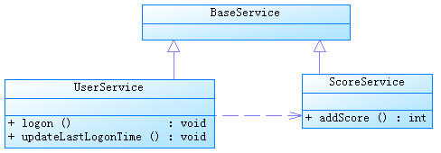

=====================================
Spring
=====================================
Spring是当前最主流的企业应用框架。
Spring解决企业级开发的复杂性问题，利用简单的JavaBean完成之前EJB所完成的工作。
简单来说，Spring是一个轻量级的控制反转（IOC）和面向且面编程（AOP）的框架。是每一个Java程序员必须学得的框架。

Spring的配置
====================================
在我们所开发的Openstack Base的工程中，利用Spring的诸多特性。
包括：AOP, Security, JavaBean, context, orm, mvc, oauth, etc.


Spring的数据源管理
-------------------------------------
Spring在使用Hibernate的时候需要进行初始化配置，建立数据源::

    <bean id="dataSource" class="com.alibaba.druid.pool.DruidDataSource">（这里使用阿里的数据库驱动）


之后进行数据库连接dataSource的各项配置：driverClassName, url(pay attention to encoding), username, password, initialSize, maxActive(最大活跃数), maxIdle(最大空闲值), minIdle(最小空闲值)。

Spring能自己管理数据连接池，但有时代码不小心也会出现连接泄漏的情况，这里碰到的问题时访问base层一段时间后出现卡在Obtaining JDBC Connection，之后超时连接错误。
目前的应对方法是在ApplicationContext.xml文件中加入如下配置::

    <property name="removeAbandoned" value="true" /> 
    <property name="removeAbandonedTimeout" value="${jdbc.removeAbandonedTimeout}" />

removeAbandoned在Spring中默认为false，即不移除遗弃的链接，这里我们设置为true，再设置超时时间为10,单位为秒，这样超过10s不进行新请求的链接将被释放回收，避免链接泄漏的情况发生。

目前的Spring 数据连接管理是自动建立和释放链接的，但是你需要使用jdbcTemplate或者使用SessionFactory.getCurrentSession()，其中，Session.getCurrentSession()是将Session绑定到Spring起的当前线程中，之后连接也就自然过度到Spring管理，自动释放；
但是如果使用SessionFactory.openSession()，是重新打开一链接，不与当前线程与事务绑定，这样如果你不手动close()的话，数据库连接就会泄漏。

如果使用jdbcTemplate，使用如下代码进行更新数据库：

   ..code:: java

    @Autowired
    private JdbcTemplate jdbcTemplate;

    String sql = "UPDATE t_user u SET u.score = u.score + ? WHERE user_name =?";
    jdbcTemplate.update(sql,toAdd,userName);
   
    jdbcTemplate.execute("INSERT INTO t_user(user_name,password,score) VALUES('tom','123456',10)");


Spring Session工厂
-------------------------------------
声明bean工厂::
    
    <bean id="sessionFactory" class="org.springframework.orm.hibernate4.LocalSessionFactoryBean">

将数据源dataSource注入进入SessionFactory::
    
    <property name="dataSource" ref="dataSource" />

命名策略::
    
    <property name="namingStrategy">
        <bean class="org.hibernate.cfg.ImprovedNamingStrategy" /> 
    </property>
    <property name="hibernateProperties">
        <props>
            <prop key="hibernate.dialect">${hibernate.dialect}</prop> 
            <prop key="hibernate.show_sql">${hibernate.show_sql}</prop> 
            <prop key="hibernate.format_sql">true</prop> 
            <prop key="hibernate.generate_statistics">${hibernate.generate_statistics}</prop> 
            <prop key="hibernate.hbm2ddl.auto">${hibernate.hbm2ddl.auto}</prop> 
        </props>
    </property>

Spring事务
=====================================
Sping提供了一致的事务管理抽象，是Spring重要的抽象之一。优点如下：

* 为不同事务API提供一致的编程模型，如JTA，JDBC，Hibernate，iBATIS数据库层和JDO；
* 提供易于使用的编程事务API；
* 整合Spring数据访问抽象；
* 支持Spring声明事务管理。

Transaction管理
-------------------------------------
事务管理也是Spring中的关键属性，首先声明事物::
    
    <bean id="transactionManager" class="org.springframework.orm.hibernate4.HibernateTransactionManager">

将SessionFactory注入到Transaction中::

    <property name="sessionFactory" ref="sessionFactory"></property>

激活Spring注解方式-事务处理::
    
    <tx:annotation-driven transaction-manager="transactionManager" />

事务带来的困扰
-------------------------------------
这次编码遇到一个简单的问题，我要对数据库进行A操作和B操作，这两个操作必须在一个事务之内，但是B操作又需要A操作commit后的结果。

这样就矛盾了，既然是事务，当然在commit前不能写进数据库中，但是A操作后的结果正是B操作需要的。

事务方法嵌套用的迷茫
-------------------------------------
（这部分文字引自http://www.ibm.com/developerworks/cn/java/j-lo-spring-ts1/）

Spring 事务一个被讹传很广说法是：一个事务方法不应该调用另一个事务方法，否则将产生两个事务。结果造成开发人员在设计事务方法时束手束脚，生怕一不小心就踩到地雷,其实这种是不认识 Spring 事务传播机制而造成的误解，Spring 对事务控制的支持统一在 TransactionDefinition 类中描述，该类有以下几个重要的接口方法::

*int getPropagationBehavior()：事务的传播行为
*int getIsolationLevel()：事务的隔离级别
*int getTimeout()：事务的过期时间
*boolean isReadOnly()：事务的读写特性

很明显，除了事务的传播行为外，事务的其它特性 Spring 是借助底层资源的功能来完成的，Spring 无非只充当个代理的角色。但是事务的传播行为却是 Spring 凭借自身的框架提供的功能，是 Spring 提供给开发者最珍贵的礼物，讹传的说法玷污了 Spring 事务框架最美丽的光；
所谓事务传播行为就是多个事务方法相互调用时，事务如何在这些方法间传播。Spring 支持 7 种事务传播行为::

*PROPAGATION_REQUIRED 如果当前没有事务，就新建一个事务，如果已经存在一个事务中，加入到这个事务中。这是最常见的选择。
*PROPAGATION_SUPPORTS 支持当前事务，如果当前没有事务，就以非事务方式执行。
*PROPAGATION_MANDATORY 使用当前的事务，如果当前没有事务，就抛出异常。
*PROPAGATION_REQUIRES_NEW 新建事务，如果当前存在事务，把当前事务挂起。
*PROPAGATION_NOT_SUPPORTED 以非事务方式执行操作，如果当前存在事务，就把当前事务挂起。
*PROPAGATION_NEVER 以非事务方式执行，如果当前存在事务，则抛出异常。
*PROPAGATION_NESTED 如果当前存在事务，则在嵌套事务内执行。如果当前没有事务，则执行与 PROPAGATION_REQUIRED 类似的操作

Spring 默认的事务传播行为是 PROPAGATION_REQUIRED，它适合于绝大多数的情况。假设 ServiveX#methodX() 都工作在事务环境下（即都被 Spring 事务增强了），假设程序中存在如下的调用链：Service1#method1()->Service2#method2()->Service3#method3()，那么这 3 个服务类的 3 个方法通过 Spring 的事务传播机制都工作在同一个事务中。

下面，我们来看一下实例，UserService#logon() 方法内部调用了 UserService#updateLastLogonTime() 和 ScoreService#addScore() 方法，这两个类都继承于 BaseService。它们之间的类结构说明如下：



具体代码如下::

    @Service("userService")
    public class UserService extends BaseService {
        @Autowired
        private JdbcTemplate jdbcTemplate;
        @Autowired
        private ScoreService scoreService;
        public void logon(String userName) {
            updateLastLogonTime(userName);
            scoreService.addScore(userName, 20);
        }                                 
        public void updateLastLogonTime(String userName) {
            String sql = "UPDATE t_user u SET u.last_logon_time = ? WHERE user_name =?";
            jdbcTemplate.update(sql, System.currentTimeMillis(), userName);
       }
    }

    @Service("scoreUserService")
    public class ScoreService extends BaseService{
        @Autowired
        private JdbcTemplate jdbcTemplate;
        public void addScore(String userName, int toAdd) {
            String sql = "UPDATE t_user u SET u.score = u.score + ? WHERE user_name =?";
            jdbcTemplate.update(sql, toAdd, userName);
        }
    }

多种数据库连接方式带来的困惑
-------------------------------------
对于Spring的ORM的实现方式有多种，可以采用高端的ORM技术（Hibernate，JPA，JDO），同时采用一个JDBC 技术（Spring JDBC，iBatis），前者使用的会话是对后者Connection的封装，Spring会机智的在同一事务中封装后者的链接，这样我们直接管Spring的事务就可以了。

是用Hibernate的代码如下::

    public void logon(String userName) {
        System.out.println("logon method...");
        updateLastLogonTime(userName); //①使用Hibernate数据访问技术
        scoreService.addScore(userName, 20); //②使用Spring JDBC数据访问技术
    }
    public void updateLastLogonTime(String userName) {
        System.out.println("updateLastLogonTime...");
        User user = hibernateTemplate.get(User.class,userName);
        user.setLastLogonTime(System.currentTimeMillis());
        hibernateTemplate.flush(); //③提前于事务提交同步数据库
    }

这里要注意，Spring中Hibernate是要等事务提交的时候进行数据库同步，这里同步的时候是在logon返回的时候，问题是addSocre使用jdbc，直接就修改数据库了，这里我们使用flush()方法来覆盖掉Hibernate的一级缓存。


Bean注入
-------------------------------------
Bean注入是Spring特色之一，进行解耦，激活Spring注解方式：自动扫描，注入bean::
    
    <context:component-scan base-package="com.neunn.cloud.base.*" />

这里是整个扫描一个包进行全初始化，通过Spring的注解@AutoWired直接使用。
上述包中的所有bean类都会被自动初始化并注入到容器中，这里bean的要求是提供无参的构造函数以及相应的get和set方法。

启动Spring对@AspectJ注解的支持::
    
    <aop:aspectj-autoproxy/>

Spring的事务增强
--------------------------------------
Spring可以增强public的方法（注意不能增强public static方法）的事务。（暂时未涉及到此处，未研究学习)

最佳实践
---------------------------------------
通过Base层代码编写，使我对Spring事务有了新的认识。

先阐述一下这次我碰到的几个问题，首先对于Hibernate更新时碰到的问题，

在Hibernate的操作时，我使用了一个危险的操作--session.clear()方法，代码如下（代码已经被我注释掉）：

::

    Assert.notNull(entity, NO_TEXT);
    entity.setLastUpdateTime(new Date());// 最后一次修改时间
    Session session = getXSession();
    // 这是一个一棍子打死的操作，慎用！
    // session.clear();
    session.update(entity);
    logger.debug("update entity: {}", entity);
    eturn getXSession().get(entity.getClass(), entity.getId());

这里我使用了session.clear()方法，但是带来的后果是所有事务的操作只有最后一个对数据库的操作是有效的，其余都被clear掉了！（调试了好几天）

如果是单纯想清空之前的缓存对象，可以用如下方法：

::

    //清空之前的缓存对象
    Object cache = session.load(Host.class, entity.getId());
    if (cache != null) {
        session.evict(cache);
    }
    session.update(entity);

由于base层的设计，增删改查这些基础操作放入基类之中，不变使用上述方法。
我用如下方法进行解决，在更新任何bean的时候首先进行查找当前活动的bean，之后进行修改后保存，可以避免两个bean冲突的问题。


Spring的作用
=======================================
Spring框架可以帮程序员快速搭建服务框架。

Inversion of Control（IOC）
---------------------------------------
控制反转（IOC）就是由容器控制程序之间的依赖（调用）关系，传统是由程序自己控制的。
就像设计模式中的模板方式和好莱坞原则：Don't call us, we will call you.

依赖注入（DI）更准确的描述了这种模式，组件之间的依赖关系由容器运行时决定，即由容器动态将依赖注入到组件之中。
例如UserRegister依赖于UserDao的实现类，UserRegister不关心USerDao的实现，由容器完成依赖。

IOC分为三种形式：

1.接口注入
```````````````````````````````````````
我们开发一个injectUserDAo接口，将一个UserDAO注入到该接口的实现类中，然后UserRegister实现该接口。如：

::

    public interface InjectUserDao(){
        public void setUserDao(UserDao userDao);
    }

    public class UserRegister implements InjectUserDao{
        private UserDao userDao = null;
        public void setUserDao(UserDao userDao){
            this.userDao = userDao;
        }
    }

同时，我们需要配置框架，这样实现接口后便可完成依赖注入了：

::

    <component> 
        <scope>request</scope> 
        <class>com.dev.spring.simple.MemoryUserDao</class> 
        <enabler>com.dev.spring.simple.InjectUserDao</enabler> 
    </component> 

2.设值注入
``````````````````````````````````````````
通过实现setter方法而进行依赖注入，是最常用的注入方式。

3.构造子注入
``````````````````````````````````````````
通过构造函数完成依赖注入，如：

:: 

    public class UserRegister{
        private UserDao userDao;
        public UserRegister(UserDao userDao){
            this.userDao = userDao;
        }
    }

Spring AOP
=========================================
Spring AOP可以有如下几种实现形式：

1.经典的基于代理的AOP；
2.@AspectJ注解驱动的切面；
3.纯POJO切面；
4.注入式AspectJ切面。


在base这个项目中，我使用aspectj进行aop代码的插入，这个配置起来比较方便，而且效率也很高。

配置文件：

:: 

    <!--启动Spring对@AspectJ注解的支持 -->
    <aop:aspectj-autoproxy/>

这样就开启spring的aspectj的功能，我们就可以使用代码实现AOP编程了。

代码实例：

::

    @Component
    @Aspect
    public class NovaAspectAdvice {
        @Before(value ="execution(* com.neunn.cloud.*.*(..))")
        public void doBefore(JoinPoint jp) {
            
        }
        @After(value ="execution(* com.neunn.cloud.*.*(..))")
        public void doAfter(JoinPoint jp) {
            
        }
        @AfterReturning(value = "execution(* com.neunn.*.create*(..))", returning = "result")
        public void doAfter(JoinPoint jp, Object result) {
            
        }
        @Around(value = "execution(* com.neunn.*.create*(..))")
        public void doAround(ProceedingJoinPoint pjp) throws Throwable {

        }
        @AfterThrowing(value = "execution(* com.neunn.*.create*(..))", throwing = "e")
        public void doThrow(JoinPoint jp, Throwable e) {

        }
    }

这里简单解释下，aspectj只是其中一种实现方法，包括五种方法，before，after，afterreturn，around，afterthrow分别作用在截获方法的开始，之后，返回后，整个执行过程，抛出异常后。
网上有个参考资料把after return中的参数写成了String类型，导致我开始运行的时候怎么也截获不到AfterReturning方法之内，差点就换其他方式进行截获了。

这里around方式没有执行成功，返回的对象jersyclient解析不了，暂时还未解决这个问题。
