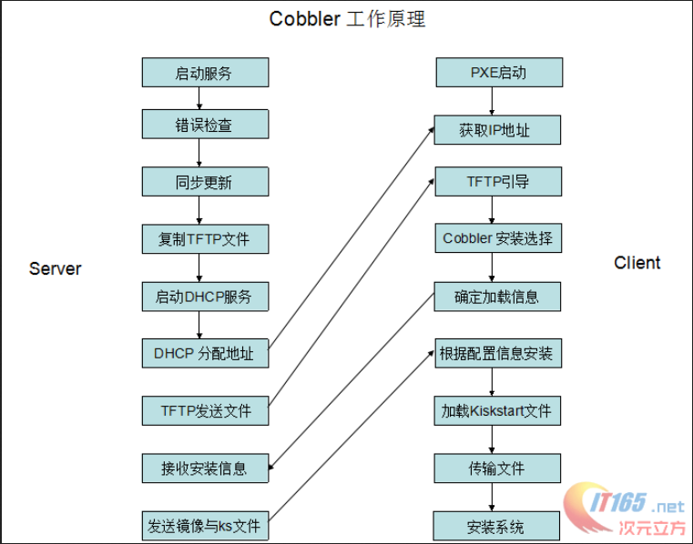
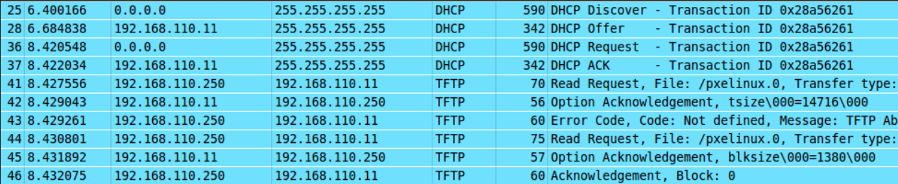

=============================================
自动化安装操作系统
=============================================
cobbler自动化安装操作系统
cobbler是redhat公司开发的自动化部署操作系统的工具，使用python编写，轻量级，利用pxe自动进行操作系统的安装。

知识梳理
=============================================

pxe
---------------------------------------------
在cobbler出现之前，操作系统都是使用pxe自动安装的，pxe是preboot excute enviroment，由intel公司进行设计开发的预执行环境，是cpu的特性，pxe的主要原理是在开机的过程进行网卡启动引导，根据TFTP和DHCP协议发出请求，收到应答后可以建立连接进行内核引导文件的传输，这部分数据首先放到网卡的内存当中，再由内存装载，之后根据FTP协议进行大量镜像数据的传输，将安装操作系统的所有文件复制到内存中，进行启动安装。

被安装的计算机必须有支持PXE启动的网卡，其中包含PXE client，当计算机引导启动时，BIOS把PXE client调入内存中执行，通过远端服务器将文件下载到本地。
运行PXE client需要设置DHCP服务器和TFTP服务器，DHCP服务器负责分配IP地址，tftp服务器则负责存储相关文件。

TFTP服务器中存储如下文件：pxelinux.0，镜像下pxeboot中的initrd.img和vmlinux，ioslinux下的所有.msg文件，以及pxelinux.cfg目录下default文件。

cobbler
---------------------------------------------
cobbler本身只是一个壳子，其关键的技术还是使用PXE引导启动和kickstart进行无人值守的配置，但使用cobbler可以大大简化这个过程，并在配置好的基础上可以“一键安装”，非常方便。目前对RedHat系列支持的很好，对其他操作系统也能自动化安装，但是配置起来相对繁琐一些。现在ubuntu也推出了集成化工具MASS，也相当好用，并且与OpenStack有很高程度的集成，进行基础配置后甚至可以一键安装OpenStack。

作用包括如下几点：快速设置网络安装环境的Linux安装服务器，管理配置，管理DNS，HDCP，TFTP和rsync，软件包升级和电源管理。

cobbler配置
=============================================
现在各大发版都有cobbler的源，直接安装即可，可以进行简单的配置，打开cobbler的配置文件，我们看到一系列的说明项目和后面的配置值，配置值可以填0或者1，0表示不由cobbler监管，1表示由cobbler监管，比如dchp服务，tftp服务等等。

几条命令：

cobbler check（检查配置）会告诉你现有的cobbler的配置有什么问题，
cobbler sync（同步配置）会将现有的cobbler配置导入，

为了印证启动时发生的情况，我们使用抓包工具对这期间的网络包进行分析，结果如下：

cobbler源码分析
=============================================
cobbler的源代码从开始，首先读取conf配置文件。

.. code:: python

    import cobbler.cli as app
    import sys

    PROFILING = False

    if PROFILING:
        print "** PROFILING **"
        import hotshot
        import hotshot.stats
        prof = hotshot.Profile("cobbler.prof")
        prof.runcall(app.main)
        prof.close()
        stats = hotshot.stats.load("cobbler.prof")
        stats.strip_dirs()
        stats.sort_stats('time')
        print "** REPORT **"
        stats.print_stats(100)
        sys.exit(0)
    else:
        sys.exit(app.main())
