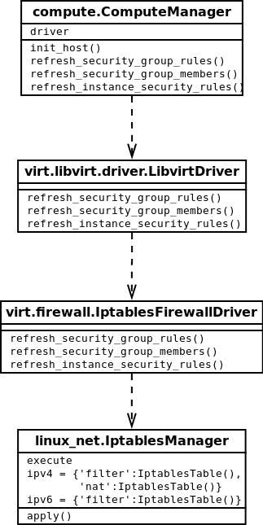
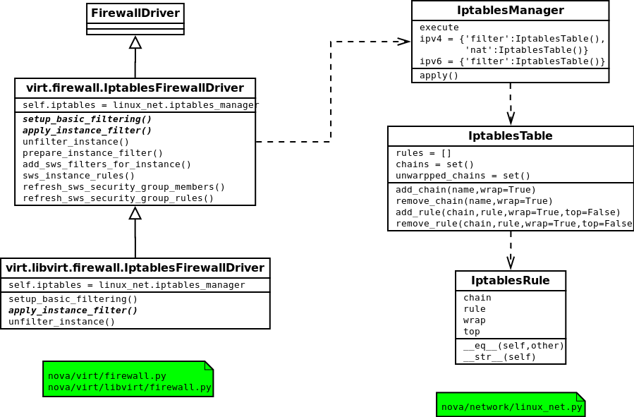

==================================
Neutron
==================================
Neutron is the network controller in openstack.

Introduction
==================================

Concpet and Relationship
----------------------------------
First, I will introduce some concept I have learned.

Network:    container of subnets.

Subnet:     virtual network including gateway, dns server, cidr.

Port:       virtual interface of router, subnet, virtual machines.

Router:     connector between subnets.

Adminstate: true if the administrator can control.

SegmentId:  use to add vlan tag or vxlan tag in network.

一个租户可以有多个Network，一个Network可以包含多个subnet，多个port，虚拟机通过port与subnet相连，subnet通过port和router进行相连，再连接到外部网络进行上网。

*一个network是一个vlan，带有一个vlan tag，这个vlan tage为segment id，一个租户可以有多个network，即可以有多个vlan，一个network可以有多个subnet，这些subnet属于同一个vlan。*

Network
===================================

Neutron Network Type
-----------------------------------
There is several types in neutron network, 'FLAT', 'VLAN', 'GRE', 'VXLAN', 'LOCAL'.

Local is local network without any configuration.

Flat is flat network like all instances are in the same network plane.

Openstack允许可以多种网络类型共存，Vlan，Vxlan，GRE可以共存。

Router
===================================
router的重要作用是绑定虚拟机和浮动IP。router在本质上宿主机一条iptable的实现，包含了跳转规则。

SecurityGroup
===================================
Security Group（安全组）是虚拟机网络中的重要组成部分，可以用来控制虚拟机之间的网络流量。
反映到底层,就是利用iptables给宿主机添加iptables规则。
可以登录一台任意Compute节点，使用iptables -L命令查看这些IP规则。

SecurityGroup
=========================================================
Openstack中nova有一个默认的安全组，如果不进行指定，nova就给寻及分配这个默认的安全组。
nova中有两个非常重要的组件，一个是db，一个是message queue，db用来记录各种状态，message queue用来在各个服务和各个节点之间传递消息，这种机制，在这里可以得到非常好的体现。

API层进行rpc后，就交给compute.ComputeManager，进行依次调用。
ComputerManager中有一个driver，都知道这个driver默认的就是libvirt，还有就是init_host()方法比较重要，每个Manager都有这样一个方法，是相对应的服务在启动的时候调用的，用来进行一些初始化，主要做的工作是对网络进行初始化，建立一些初始的chain和rule。

SecurityGroup属性
---------------------------------------------------------

每个安全组可以有多个规则，每个规则的属性如下：

ipProtocol: means the ip protocol of the security group, like ICMP, TCP, UDP, and so on.

fromport, toport: 这条安全组规则的影响端口范围，例如22就表示ssh，443表示http与https. To be noticed, fromport=-1 and toport=-1 means all port will be affated.

cidr: 无类别域间路由，这里区别于传统的A、B、C类网络地址，可以是任意进行IP类别划分, such as 192.168.250.222/28, it means that ip in that block will be affected by this security goup rule.

source group: it means this security group affact the members(virtual machine) of other security goups.

for example, we can add this command: nova secgroup-add-rule default tcp 22 22 172.31.0.224/28. Then we will get this:

+--------------+--------------+--------------+--------------+--------------+
| IP Protocol  | From Port    | To Port      | IP Range     | Source Group |
+--------------+--------------+--------------+--------------+--------------+
|     tcp      |    22        |     22       | 172.31.0.224 |              | 
+--------------+--------------+--------------+--------------+--------------+

目前Openstack社區將Neutron分离出來，Neutron的安全組更便於使用。
Nova的安全組默認只支持入口规则创建，而Neutron可以双向控制。

SecurityGroupRule
============================================================

SecurityGroupRule的属性
------------------------------------------------------------
最近看了下nuetron和nova network对securitygroup的差异，总结如下：

总体功能和界面体现并误差，实现上完全从nova分离，转到neutron的管理中，nova则更关注与compute相关的信息。
但在rest api返回上，字段发生了比较明显的变化。

nova返回的security group rule的json格式：

::

    "rules": [
        {
            "from_port": 99,                                            #端口起始地址，与toPort构成集合
            "group": {                                                  #允许被另一个租户的安全组为aaa的机器访问
                "tenant_id": "51b1873935554545bb9b953e4055a997",        #自身租户ID或者另一安全组的所属租户ID（待查）
                "name": "aaaaaaaaaaaaaaaaa"                             #允许被另一安全组访问的安全组名称
            },
            "ip_protocol": "tcp",                                       #访问协议
            "to_port": 99,                                              #
            "parent_group_id": "2b430fbb-656f-4c56-a863-786bb8f97b0b",  #所属安全组ID
            "ip_range": {},                                             #允许被访问的网络cidr，与group之间是二取一的关系
            "id": "09245bbd-6e03-4264-9c19-27a534702c3d"                #自身ID
        }                                                                                                                                                   
    }

neutron返回的security group rule的json格式：

::

    "security_group_rule": {
        "remote_group_id": "f7518f66-9f50-4568-b42d-5577f6899ad9",      #可访问的远程安全组id
        "direction": "ingress",                                         #访问方向，ingress表示从外部访问虚拟机
        "remote_ip_prefix": null,                                       #可访问的远程cidr，与remote_group_id之间是二取一的关系
        "protocol": null,                                               #可访问的网络协议
        "tenant_id": "dc3c2f4fd2a84ddbba087360d10461db",                #所属租户ID
        "port_range_max": null,                                         #端口范围最大值（同上面的toPort）
        "security_group_id": "f7518f66-9f50-4568-b42d-5577f6899ad9",    #所属安全组的ID
        "port_range_min": null,                                         #端口范围最小值（同上面的fromPort）
        "ethertype": "IPv4",                                            #网络类型（ipv4/ipv6)
        "id": "0bd5a998-c392-4da2-8450-14219883e515"                    #自身ID
    }

SecurityGroupRule的创建
----------------------------------------------------------------
OpenStack创建安全组规则的时候会提供很多定义好的安全组模板，可以大大简化用户的操作量，这里就解释下所有定义好的规则所对应的协议和端口。
这是一种设计理念，将常用的操作简化出来供用户直接使用，可以提高用户满意度。

+---------------+-------------------+-------------------------+-----------------------+----------------------------+
|      序号     | 安全组规则名称    |      协议（Protocol）   |         端口          |         说明               |
+===============+===================+=========================+=======================+============================+
|      1        |     DNS           |        TCP              |        53             | 域名系统协议               |
+---------------+-------------------+-------------------------+-----------------------+----------------------------+
|      2        |     HTTP          |        TCP              |        80             | 超文本传输协议             |
+---------------+-------------------+-------------------------+-----------------------+----------------------------+
|      3        |     HTTPS         |        TCP              |        443            | 加密的超文本传输协议       |
+---------------+-------------------+-------------------------+-----------------------+----------------------------+
|      4        |     IMAP          |        TCP              |        143            | 互联网消息存取协议         |
+---------------+-------------------+-------------------------+-----------------------+----------------------------+
|      1        |     IMAPS         |        TCP              |        993            | 加密的互联网消息存取协议   |
+---------------+-------------------+-------------------------+-----------------------+----------------------------+
|      1        |     LDAP          |        TCP              |        389            | 轻量目录访问协议           |
+---------------+-------------------+-------------------------+-----------------------+----------------------------+
|      1        |     MS SQL        |        TCP              |        1433           | SQL Server数据库协议       |
+---------------+-------------------+-------------------------+-----------------------+----------------------------+
|      1        |     MYSQL         |        TCP              |        3306           | MYSQL数据库协议            |
+---------------+-------------------+-------------------------+-----------------------+----------------------------+
|      1        |     POP3          |        TCP              |        110            | 邮局协议                   |
+---------------+-------------------+-------------------------+-----------------------+----------------------------+
|      1        |     POP3S         |        TCP              |        995            | 加密的邮局协议             |
+---------------+-------------------+-------------------------+-----------------------+----------------------------+
|      1        |     RDP           |        TCP              |        3389           | 远程显示协议               |
+---------------+-------------------+-------------------------+-----------------------+----------------------------+
|      1        |     SMTP          |        TCP              |        25             | 简单邮件传输协议           |
+---------------+-------------------+-------------------------+-----------------------+----------------------------+
|      1        |     SMTPS         |        TCP              |        465            | 加密的简单邮件传输协议     |
+---------------+-------------------+-------------------------+-----------------------+----------------------------+

参考链接：
http://cert.sjtu.edu.cn/doc/linux/ch-ports.html
