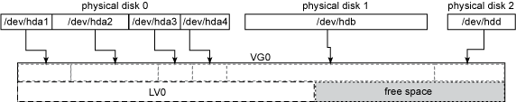

===================================
LVM
===================================
Logical Volume Manager(LVM)是Linux下磁盘管理工具，可以进行磁盘管理，动态增缩磁盘空间

LVM逻辑卷管理指系统将物理卷管理抽象到更高的层次，形成更简单的管理模式，通过LVM，将所有的磁盘和分区作为统一的数据源管理。（例如你有几个80G的硬盘，想创建一个200G的文件系统）

你可以使用LVM进行一下操作（典型操作）：

在磁盘池中添加磁盘和分区，对现有的文件系统进行在线扩展；
用一个 160GB 磁盘替换两个 80GB 磁盘，而不需要让系统离线，也不需要在磁盘之间手工转移数据
当存储空间超过所需的空间量时，从池中去除磁盘，从而缩小文件系统；
使用快照（snapshot）执行一致的备份（本文后面会进一步讨论）等。

LVM的结构
------------------------------------
LVM被组织为三种元素::

*卷(Volume): 物理和逻辑卷和卷组
*区段(Extent): 物理和逻辑区段
*设备映射器(Device mapper): Linux内核模块

物理卷是物理磁盘或者物理分区（例如/dev/hda或/dev/hda1），卷组（VG）是物理卷的集合，卷组可以在逻辑上划分多个逻辑卷。

之后对LV0进行格式化，之后挂载到/var。

在做PV与LV的映射中，PV和VG的基本块必须具有相同的大小，这些基本块称为物理区段（PE）和逻辑区段（LE）。尽管是一个n-to-m的映射，但PE与LE是一一对应的。

这里需要注意几点::

*默认的区段大小是4M；
*区段的大小不影响磁盘的IO性能，但会影响LVM工具的效率；
*动态扩展不会丢失数据，但修改区段的大小可能会丢失数据；
*LVM并非连续的分配PE；

最后的磁盘区段映射可能为如下所示：

常见任务
-------------------------------------
创建新卷：

可以使用LVM进行新卷的创建，初始化分区(pvcreate)，创建PV和VG(vgcreate)，创建新的逻辑卷(lvcreate)，使用文件系统格式化后可以进行挂载了；

扩展卷：

使用物理磁盘创建一个分区，进行初始化(pvcreate)，添加到现有的VG中(vgextend)，扩展逻辑卷(lvextend)，扩展文件系统(resize_resierfs)；

管理卷：

虽然大多数文件系统都不支持缩小在线文件系统，lvm还是支持这个功能，首先进行umount，缩小文件系统，缩小逻辑卷(lvreduce)；
释放前禁止PV的分配(pvchange)，从释放的PV中移出数据(pvmove)，还有其他功能，请参考http://www.ibm.com/developerworks/cn/linux/l-lvm2/。

用快照执行备份
---------------------------------------
LVM可以创建磁盘的快照，创建新的快照 LV 也是使用 lvcreate 命令，但是要指定 -s 参数和原来的 LV。在这种情况下，-L size 指定例外列表的大小，这影响快照支持的最大差异量，如果差异超过这个量，就无法保持一致性::

*lvcreate -s -L 2G -n snap/dev/test-volume/test

对于所有日常操作，快照看起来就是 原 LV 的一个拷贝。如果已经建立了文件系统的话，可以用以下命令挂载它::

*mount -o ro /dev/test-volume/test /mnt/snap

这里注意，如果数据库建立在 LV 上，并且需要一个一致的备份，那么一定要刷新表并在获得读取锁（read-lock）的情况下建立快照卷。

支持虚拟化功能
----------------------------------------
因为流行的虚拟化系统（比如 Xen、VMWare、Qemu 和 KVM）可以将块设备用作 guest 映像，所以可以创建这些映像的完整拷贝，并根据需要使用它们，它们就像是内存占用量很低的虚拟机。这样做的好处是部署迅速（创建快照的时间常常不超过几秒）和节省空间（guest 共享原映像的大多数数据）:
1.为原映像创建一个逻辑卷； 
2.使用这个 LV 作为磁盘映像安装 guest 虚拟机； 
3.暂停这个虚拟机。内存映像可以是一个常规文件，所有其他快照都放在里面； 
4.为原 LV 创建一个可读写的快照； 
5.使用快照卷作为磁盘映像生成一个新的虚拟机。如果需要的话，要修改网络/控制台设置； 
6.登录已经创建的虚拟机，修改网络设置/主机名。

DeviceMapper
========================================
DeviceMapper做为LVM的实现机制，是在Linux内核2.6版本后加入的。
使用的基本思想是机制与策略分离，由Linux的内核来实现映射机制，而由用户态程序来进行策略控制。

DeviceMapper由三部分组成：mapped device（向外提供逻辑设备），映射表，target device（物理空间段）。
类似一个数结构，mapped device充当根节点，target device充当叶子节点，是一对多的关系。
并且一个mapped device又可以作为上一层的target device，在层次上可以无限迭代下去。

.. image:: images/devicemapper.jpg
