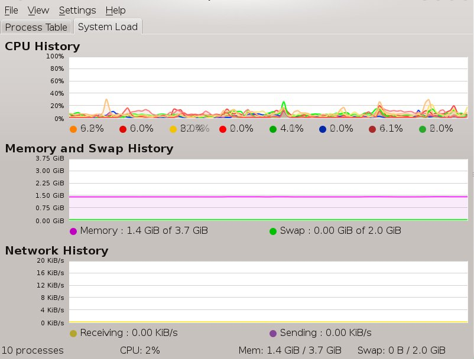
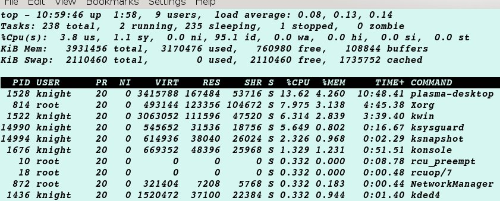
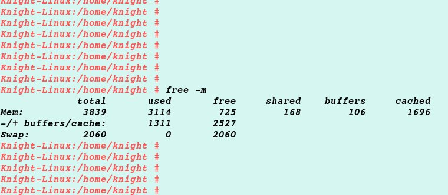

=============================
Linux Memory
=============================

Problem
=============================
When I use OpenSuse Linux, I often found that the computer memory is out of use. So I open the Ksysguard(KDE System monitor) and take a look at my memory and swap history.

But when I run the 'top' and 'free' command in terminal, I get this:

it matches free command, like this:

Why do command and ksysguard not match eachother?

Basic Concept
===============================

Memory:

Application Memory: the application memory, you can set limits in /etc/security/limits.conf, and you can check it in /proc/XXXX/limits

Buffer: Buffers is the size of in-memory block I/O buffers, which policy is first-in, first-out.

Cache Memory: Cached is the size of the page cache, whick policy is Least Recently Used. Cache memory can easily be several gigabytes. It will shrink only in response to memory pressure.

After we learn the concept, we can easily surmise that ksysguard does't display the cache memory in use. But my litter tool that can show all the memory in use.

Optimization
================================

First comes to my thoughts, is to limit application memeory so that the memory has more space for system and kernel.

Use Swap as part of the virtual memeory.

Test
--------------------------------
After running some application in opensuse the cache memory is about 700MB. It will increase while the system is running. 
