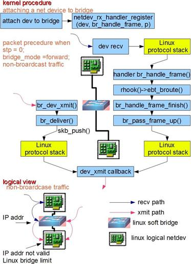
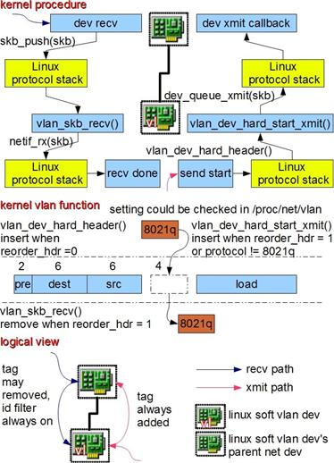
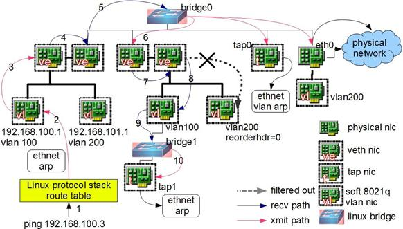
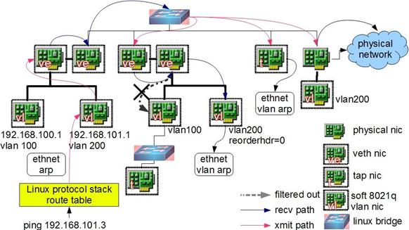
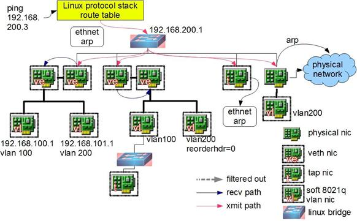
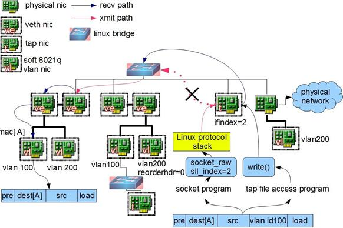

==============================
Linux Network
==============================
Network virtulization is an import part of cloud computing. We can use Linux network device to meet our request. We can manage them, use them to help us find the problem.

Introduction
------------------------------
We know the when we use a network device such as the nic, we have an network instance like 'eth0'. These instances are the mapping of the nic device. 
In Linux, we use more abstract type of device, which are: bridge, 802.1.q vlan device, veth, tap. With these instances and ip table, route table we can create virtual network.

Bridge
------------------------------
Bridge is a virtual device used for TCP/IP second layer(ip protocol) transmission. It is like a virtual switch. When package recieved in bridge, it will forward, broadcast or drop the packages by the information of mac. Bridge is in Linux kernel.



When a device is attached to bridge, it is like that a switch is connect to a cable.
In kernel, netdev_rx_handler_register() is called, and then a callback function is regestered, which can forward the data package to bridge.
Something different from the actual switch, packages are sent to bridge directly, not from a port in bridge. We can asumme that bridge is directly attached to eth0. So when a bridge joins eth0, actually this bridge has two valiad mac address, one is the bridge mac address, the other is eth0 mac address.
Bridge can be set with an ip address, so that we can discover this bridge in the third layer.

One thing to notice, when a network interface is attached to a bridge, the ip address of that network interface will become invaliad.
For example, eth0's ip is 192.168.1.2, then it is attached to bridge0, we should make bridge0's ip 192.168.1.2.

Another thing to notice is the data direction. For example, when a network interface is attached to a bridge, if a reqeust is send type, it will sent to sending exit.

Vlan device for 802.1.q
------------------------------
Vlan stands for virtual lan, which is use to isolate the networks in layer 2(data link layer).



Vlan device for 802.1.q in Linux network appears in pair of mother device and son device. Mother device is just like the trunk port in switch, which is connected to uppper level network; son device is just like access port in switch, which is conneted to virtual machine. To host machine, mother device is used to recieve package, son device is used to send package.
When a package with 100 vlan tag is recive to mother device, mother device will take off the vlan tag and send the package to approprate son device.

One thing to notice is that mother device and son device has the same mac address. We can assume that it is a 802.1.q switch. But vlan device in Linux can only support the function of isolation, not transmission.
We can use both vlan device and bridge in Linux, then we will get all the functions we need.

Linux supports optimization by hardware, the vlan device can be moved to hardware to optimize the network.

TAP device and VETH device
------------------------------
TUN/TAP device is a tool that let users programm send package to kernel.

.. image:: ../../images/linux/tap.jpg

When a tap device is created, a char device will be created in linux device catagory. Users can write the char file. 
When doing this, it is as the data is sent to the tap device. Linux network will get the package by tap device. Then Linux will request the kernel to accept the package, just like the network interface get the package. 
When users application do 'read()' actions, it is just like asking the kernel has data package to send by the tap device.

Veth device come in pairs. Data comes into one end and comes out to the other end.

Network Configuration
------------------------------
Here is an example of Linux network device:
A center bridge, which is attached by 4 devices, including 2 pair veth device, 1 tap device tap0, 1 network device eth0.
There are vlan devices attached to veth device, including 2 vlan tag, vlan 100 and vlan 200.
Network device eth0 is connected to outer network, and a son vlan device with tag 200 is created under eth0.

Sending package from vlan 100 device
`````````````````````````````````````````




In this case, when user ping 192.168.100.3, Linux send arp request to vlan 100 device, the request 'APR@vlan100' go through veth device and broadcast on bridge0.
The request go into the other veth device and handled by vlan logic and go into vlan 100 device. The vlan device will drop the vlan tag and change the package to normal arp request 'ARP', and bridge1 broadcast the arp package again.
The request go into tap0. User can read this arp reqeust 'ARP@vlan100'
The request go into eth0, but the son vlan device does not get this request because it is request sent package.

Seding package from vlan 200 device
`````````````````````````````````````````




It is the same with sending package from vlan 100. The difference is that the other vlan 200 device is set reorder_hdr = 0(keep the vlan tag of package recieved), the son device will get arp package with vlan tag('ARP@vlan200').

Sending package from center bridge
`````````````````````````````````````````




If bridge0 has an ip, user application can send arp package to bridge0 by router table.
Tap device and external network can recive the package, but vlan device cant not.

Sending package 'ARP@vlan200' from external network to eth0
```````````````````````````````````````````````````````````````````````


.. image:: ../../images/linux/network4.jpg

When this happens, all vlan device with tag vlan200 will recieve the package, and the tap device will also recieve the package as 'ARP@vlan200'.

Sending arp request from tap device
`````````````````````````````````````````````````````


.. image:: ../../images/linux/network5.jpg

Create an ip fro tap0, and add it to router table. Send ping arp package from tap0.
Because the package from tap0 is sending request, so the package does not go into bridge0, and nothing happens.
If we ping from vlan 200 son device, as there is no veth device to revert the request direction, this package will go directly to network interface eth0.

Sending package from tap by file operation
```````````````````````````````````````````````````````




user application can use tap device by two ways: socket and file operation. When user use socket, the situation will be the same from ping from tap devivce.
But when we open the tap file and write to it, it will touch off forwarding action. The bridge will recieve and broadcast the package.

Dirver development
---------------------------------------------
In this time, I aim to the MAC(Media Access Control ) layer.

DMA
`````````````````````````````````````````````
DMA(Direct Memory Access) can assist the processer with recieving and sending package. 
It can send the packages without processer processing.
When recieving message, it can notify the processer and wait for the processing.

DMA using BD(Buffer Description) as sending and reciving unit.
Each package will divide into some frame. Every frame is stored in one BD, like this:
    
.. code::

   typedef struct{
        void \*bufprt;  //save the start address of BD
        int length;     //save length of package stored
        int sc;         //save the state of BD
   }BD_STRUCT;


Optimization
==========================================
With network device is improving, the network speed doesn't match, because the speed is also limited by the processor.

Cache
``````````````````````````````````````````
Cache is more faster than the memnory. If we use the 'wirte back' mode, the package is stored in cache not writen to memory, until other data need to updated into cache. 
It is more efficient than 'write through' mode, which is, the data is writen to memory right after it is updated into cache.

Device interface mode
``````````````````````````````````````````
PHY module has two mode: mandatory and auto-negotiation. It depends on the other side of network. 

MAC module must be set the mode match to the PHY mode.


Reference
------------------------------
http://www.ibm.com/developerworks/cn/linux/1310_xiawc_networkdevice/

SDN 
------------------------------------------
SDN is full name of software defined network.
It devides the data plane from control plane, and control the network flow more flexibly.


Mininet
------------------------------------------
Mininet is light software defined network and test platform. It can be simply regarded as a platform based on process virtualization.

Mininet features:

* Support OpenFlow, OpenvSwitch network component.
* Support reduction test, complex topotology, self defined network.
* Python API.
* Portability and scalability.
* Support thousands of servers' network.


